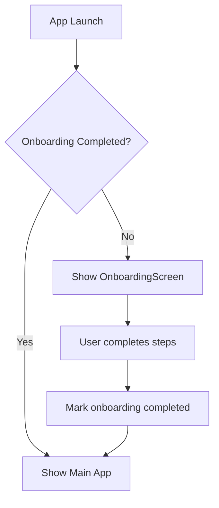
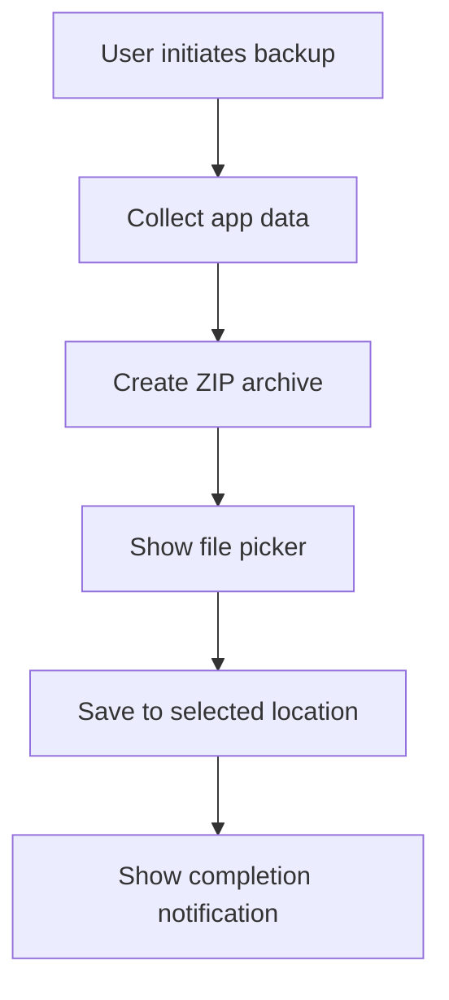
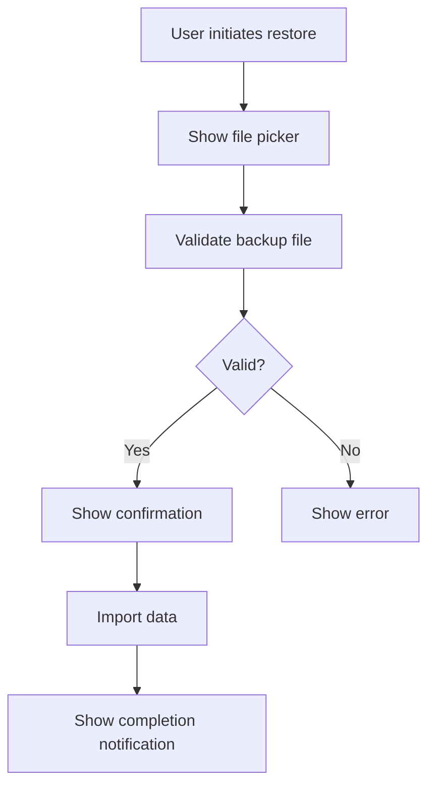

# Onboarding and Backup/Restore Features - Design Specification

**Date:** 2026-04-19
**Status:** Draft
**Author:** AI Assistant

## Overview

This specification outlines the design for two new features to enhance the summsumm app:
1. **Onboarding Experience**: Improved first-time user setup and feature introduction
2. **Backup/Restore System**: Complete app data backup and restore functionality

## 1. Onboarding Feature

### 1.1 Requirements

- **Scope**: Basic setup guide + API key setup assistance
- **Trigger**: First app launch (when no onboarding completion flag exists)
- **User Control**: Ability to skip and re-trigger onboarding
- **Integration**: Seamless transition to main app after completion

### 1.2 Architecture

#### 1.2.1 Components

**OnboardingService**
- Manages onboarding state persistence
- Tracks completion status
- Provides reset capability

**OnboardingScreen**
- Multi-step guided setup process
- API key setup assistance
- Provider selection guidance

**Integration Points**
- `main.dart`: Launch decision logic
- `SettingsScreen`: Re-trigger option
- Existing screens: Contextual help integration

#### 1.2.2 Data Flow



### 1.3 Implementation Details

#### 1.3.1 OnboardingService

```dart
class OnboardingService {
  static const _completedKey = 'onboarding_completed';
  final SharedPreferences _prefs;

  OnboardingService(this._prefs);

  Future<bool> isCompleted() async => _prefs.getBool(_completedKey) ?? false;
  Future<void> markCompleted() async => await _prefs.setBool(_completedKey, true);
  Future<void> reset() async => await _prefs.remove(_completedKey);
}
```

#### 1.3.2 Onboarding Screen Steps

1. **Welcome Step**: App introduction and value proposition
2. **API Key Setup**: Provider selection and key entry guide
3. **Model Selection**: Explanation of model choices
4. **Feature Overview**: Quick tour of main features
5. **Completion**: Summary and transition to main app

#### 1.3.3 UI Integration

- Add onboarding check in `main.dart` before showing `SummsummApp`
- Add "Show onboarding again" option in SettingsScreen
- Optional: Add contextual tooltips for first-time feature usage

### 1.4 Error Handling

- **Skipped Onboarding**: Allow normal app usage, provide way to access later
- **Corrupted State**: Fallback to showing onboarding again
- **Partial Completion**: Resume from last completed step

### 1.5 Testing Strategy

- Unit tests for `OnboardingService` state management
- Widget tests for `OnboardingScreen` navigation
- Integration tests for complete onboarding flow
- Edge case testing (skipping, partial completion, reset)

## 2. Backup/Restore Feature

### 2.1 Requirements

- **Scope**: Complete backup (settings + meetings)
- **Storage**: Custom location selection via file picker
- **Format**: ZIP archive with structured contents
- **User Control**: Manual trigger for both backup and restore

### 2.2 Architecture

#### 2.2.1 Components

**BackupService**
- Collects all app data
- Creates structured ZIP archive
- Handles file I/O operations

**Extended ImportService**
- Validates backup files
- Imports settings and meetings
- Handles data conflicts

**UI Components**
- Backup/Restore section in SettingsScreen
- File picker integration
- Progress indicators

#### 2.2.2 Data Flow

**Backup Flow:**


**Restore Flow:**


### 2.3 Implementation Details

#### 2.3.1 Backup Service

```dart
class BackupService {
  final SettingsProvider _settings;
  final MeetingRepository _meetings;

  BackupService(this._settings, this._meetings);

  Future<String> createBackup() async {
    // 1. Get current settings
    final settings = await _settings.getCurrentSettings();
    
    // 2. Get all meetings
    final meetings = await _meetings.loadAll();
    
    // 3. Create temporary directory
    final tempDir = await Directory.systemTemp.createTemp('summsumm_backup_');
    
    // 4. Write settings.json
    final settingsFile = File('${tempDir.path}/settings.json');
    await settingsFile.writeAsString(jsonEncode(settings.toJson()));
    
    // 5. Write meetings directory
    final meetingsDir = Directory('${tempDir.path}/meetings');
    await meetingsDir.create();
    for (final meeting in meetings) {
      final meetingFile = File('${meetingsDir.path}/${meeting.id}.json');
      await meetingFile.writeAsString(jsonEncode(meeting.toJson()));
    }
    
    // 6. Create manifest
    final manifest = {
      'version': '1.0',
      'timestamp': DateTime.now().toIso8601String(),
      'app_version': '1.0.0',
      'settings_count': 1,
      'meetings_count': meetings.length
    };
    final manifestFile = File('${tempDir.path}/manifest.json');
    await manifestFile.writeAsString(jsonEncode(manifest));
    
    // 7. Create ZIP archive
    final backupFile = File('${tempDir.path}/summsumm_backup_${DateTime.now().formatted()}.zip');
    await ZipFile.createFromDirectory(
      sourceDir: tempDir,
      zipFile: backupFile,
    );
    
    // 8. Cleanup and return path
    await tempDir.delete(recursive: true);
    return backupFile.path;
  }
}
```

#### 2.3.2 Extended Import Service

```dart
class ImportService {
  // ... existing methods ...

  Future<void> importCompleteBackup(String backupPath) async {
    // 1. Extract ZIP to temporary directory
    final tempDir = await Directory.systemTemp.createTemp('summsumm_restore_');
    await ZipFile.extractToDirectory(zipFile: File(backupPath), destinationDir: tempDir);
    
    // 2. Validate manifest
    final manifestFile = File('${tempDir.path}/manifest.json');
    if (!await manifestFile.exists()) {
      throw BackupValidationException('Invalid backup file: missing manifest');
    }
    
    final manifest = jsonDecode(await manifestFile.readAsString()) as Map<String, dynamic>;
    if (manifest['version'] != '1.0') {
      throw BackupValidationException('Unsupported backup version: ${manifest['version']}');
    }
    
    // 3. Import settings
    final settingsFile = File('${tempDir.path}/settings.json');
    if (await settingsFile.exists()) {
      final settingsJson = jsonDecode(await settingsFile.readAsString()) as Map<String, dynamic>;
      final settings = AppSettings.fromJson(settingsJson);
      await _importSettings(settings);
    }
    
    // 4. Import meetings
    final meetingsDir = Directory('${tempDir.path}/meetings');
    if (await meetingsDir.exists()) {
      final meetingFiles = meetingsDir.listSync().where((f) => f.path.endsWith('.json'));
      for (final file in meetingFiles) {
        final meetingJson = jsonDecode(await File(file.path).readAsString()) as Map<String, dynamic>;
        final meeting = Meeting.fromJson(meetingJson);
        await _repository.save(meeting);
      }
    }
    
    // 5. Cleanup
    await tempDir.delete(recursive: true);
  }

  Future<void> _importSettings(AppSettings settings) async {
    // Handle API keys separately (secure storage)
    if (settings.openaiKey.isNotEmpty) {
      await ref.read(secureStorageProvider).saveApiKey('openai', settings.openaiKey);
    }
    if (settings.openrouterKey.isNotEmpty) {
      await ref.read(secureStorageProvider).saveApiKey('openrouter', settings.openrouterKey);
    }
    
    // Save remaining settings
    final cleanSettings = settings.copyWith(
      openaiKey: '',
      openrouterKey: ''
    );
    final prefs = await SharedPreferences.getInstance();
    await prefs.setString(_prefsKey, cleanSettings.toJsonString());
    
    // Update provider state
    ref.read(settingsProvider.notifier).state = cleanSettings;
  }
}
```

#### 2.3.3 Backup File Format

```
summsumm_backup_YYYYMMDD_HHMMSS.zip
├── settings.json          # AppSettings.toJson()
├── meetings/             # Individual meeting JSON files
│   ├── meeting1.json
│   ├── meeting2.json
│   └── ...
└── manifest.json          # Metadata and version info
```

**manifest.json structure:**
```json
{
  "version": "1.0",
  "timestamp": "2026-04-19T12:34:56.789Z",
  "app_version": "1.0.0",
  "settings_count": 1,
  "meetings_count": 42
}
```

#### 2.3.4 UI Integration

**SettingsScreen Additions:**
```dart
// In the settings screen widget tree:
_SectionCard(
  title: 'Backup & Restore',
  icon: Icons.backup_outlined,
  children: [
    ListTile(
      leading: Icon(Icons.archive_outlined),
      title: Text('Create Backup'),
      subtitle: Text('Export all app data to custom location'),
      onTap: _createBackup,
    ),
    ListTile(
      leading: Icon(Icons.unarchive_outlined),
      title: Text('Restore Backup'),
      subtitle: Text('Import app data from backup file'),
      onTap: _restoreBackup,
    ),
  ],
)
```

### 2.4 Error Handling

- **File Validation**: Check manifest version and structure
- **Data Integrity**: Verify JSON parsing succeeds
- **Conflict Handling**: Overwrite existing data with backup data
- **User Confirmation**: Warn about data overwrites
- **Partial Restore**: Rollback on failure, show detailed error

### 2.5 Testing Strategy

- Unit tests for backup creation and validation
- Unit tests for restore process and edge cases
- Integration tests for complete backup/restore cycle
- Error case testing (corrupt files, version mismatches)
- Performance testing with large datasets

## 3. Integration Points

### 3.1 Dependency Additions

Add to `pubspec.yaml`:
```yaml
dependencies:
  archive: ^3.6.0  # For ZIP archive handling
  file_picker: ^8.0.0  # For custom location selection
```

### 3.2 Provider Additions

```dart
@Riverpod(keepAlive: true)
OnboardingService onboardingService(OnboardingServiceRef ref) {
  final prefs = ref.watch(sharedPreferencesProvider);
  return OnboardingService(prefs);
}

@Riverpod(keepAlive: true)
BackupService backupService(BackupServiceRef ref) {
  final settings = ref.watch(settingsProvider.notifier);
  final meetings = MeetingRepository();
  return BackupService(settings, meetings);
}
```

### 3.3 Main App Integration

Modify `main.dart` to check onboarding status:
```dart
// In main() function, after ProviderScope setup:
final onboardingCompleted = await ref.read(onboardingServiceProvider).isCompleted();

runApp(
  ProviderScope(
    child: SummsummApp(
      openSettings: openSettings,
      documents: documents,
      showOnboarding: !onboardingCompleted,
    ),
  ),
);
```

## 4. Implementation Plan

### 4.1 Phase 1: Onboarding Feature
1. Create `OnboardingService` class
2. Build `OnboardingScreen` with step navigation
3. Integrate with `main.dart` launch flow
4. Add re-trigger option to SettingsScreen
5. Write unit and widget tests

### 4.2 Phase 2: Backup/Restore Feature
1. Implement `BackupService` with ZIP creation
2. Extend `ImportService` for complete backups
3. Add UI components to SettingsScreen
4. Implement file picker integration
5. Write comprehensive tests

### 4.3 Phase 3: Integration and Testing
1. Test complete feature workflows
2. Handle edge cases and errors
3. Optimize performance
4. Final user acceptance testing

## 5. Success Metrics

- **Onboarding**: 
  - 90%+ of new users complete onboarding
  - Reduced support requests for basic setup
  - Increased user retention

- **Backup/Restore**:
  - 100% data integrity in backup files
  - <5% restore failure rate
  - Successful migration between devices

## 6. Open Questions

1. Should onboarding be mandatory or optional?
2. What should be the maximum backup file size limit?
3. Should we add backup file encryption for sensitive data?
4. Should we implement incremental backups for performance?

## 7. Future Enhancements

- **Onboarding**:
  - Interactive tutorials with real API calls
  - Personalized onboarding based on user goals
  - A/B testing of different onboarding flows

- **Backup/Restore**:
  - Automatic scheduled backups
  - Cloud storage integration
  - Backup file encryption
  - Selective restore options
  - Backup history and versioning

---

**Approval Status**: Pending
**Next Steps**: User review → Implementation planning → Development