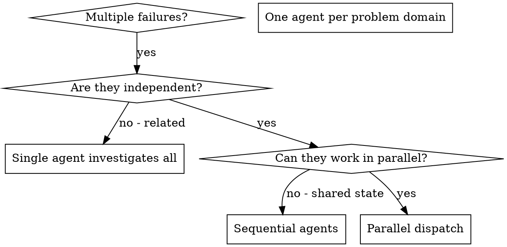

# On-device transcription workflow errors

**Session ID:** ses_21d25fb60ffeuaHtg6xJqVkp6T
**Created:** 5/1/2026, 11:23:52 AM
**Updated:** 5/1/2026, 11:27:07 AM

---

## User

review on-device transcription. the entire workflow for normal transcription and diarized transcription. review state changes, wake locks, preprocessing audio, missing models, model selection, chunking, etc. find errors. currently i get error for on-device transcript "failed to create offline recognizer, please check config"

---

## Assistant (Build · GPT-5.5 · 10.4s)

**Tool: skill**

**Input:**
```json
{
  "name": "systematic-debugging"
}
```

**Output:**
```
<skill_content name="systematic-debugging">
# Skill: systematic-debugging

# Systematic Debugging

## Overview

Random fixes waste time and create new bugs. Quick patches mask underlying issues.

**Core principle:** ALWAYS find root cause before attempting fixes. Symptom fixes are failure.

**Violating the letter of this process is violating the spirit of debugging.**

## The Iron Law

```
NO FIXES WITHOUT ROOT CAUSE INVESTIGATION FIRST
```

If you haven't completed Phase 1, you cannot propose fixes.

## When to Use

Use for ANY technical issue:
- Test failures
- Bugs in production
- Unexpected behavior
- Performance problems
- Build failures
- Integration issues

**Use this ESPECIALLY when:**
- Under time pressure (emergencies make guessing tempting)
- "Just one quick fix" seems obvious
- You've already tried multiple fixes
- Previous fix didn't work
- You don't fully understand the issue

**Don't skip when:**
- Issue seems simple (simple bugs have root causes too)
- You're in a hurry (rushing guarantees rework)
- Manager wants it fixed NOW (systematic is faster than thrashing)

## The Four Phases

You MUST complete each phase before proceeding to the next.

### Phase 1: Root Cause Investigation

**BEFORE attempting ANY fix:**

1. **Read Error Messages Carefully**
   - Don't skip past errors or warnings
   - They often contain the exact solution
   - Read stack traces completely
   - Note line numbers, file paths, error codes

2. **Reproduce Consistently**
   - Can you trigger it reliably?
   - What are the exact steps?
   - Does it happen every time?
   - If not reproducible → gather more data, don't guess

3. **Check Recent Changes**
   - What changed that could cause this?
   - Git diff, recent commits
   - New dependencies, config changes
   - Environmental differences

4. **Gather Evidence in Multi-Component Systems**

   **WHEN system has multiple components (CI → build → signing, API → service → database):**

   **BEFORE proposing fixes, add diagnostic instrumentation:**
   ```
   For EACH component boundary:
     - Log what data enters component
     - Log what data exits component
     - Verify environment/config propagation
     - Check state at each layer

   Run once to gather evidence showing WHERE it breaks
   THEN analyze evidence to identify failing component
   THEN investigate that specific component
   ```

   **Example (multi-layer system):**
   ```bash
   # Layer 1: Workflow
   echo "=== Secrets available in workflow: ==="
   echo "IDENTITY: ${IDENTITY:+SET}${IDENTITY:-UNSET}"

   # Layer 2: Build script
   echo "=== Env vars in build script: ==="
   env | grep IDENTITY || echo "IDENTITY not in environment"

   # Layer 3: Signing script
   echo "=== Keychain state: ==="
   security list-keychains
   security find-identity -v

   # Layer 4: Actual signing
   codesign --sign "$IDENTITY" --verbose=4 "$APP"
   ```

   **This reveals:** Which layer fails (secrets → workflow ✓, workflow → build ✗)

5. **Trace Data Flow**

   **WHEN error is deep in call stack:**

   See `root-cause-tracing.md` in this directory for the complete backward tracing technique.

   **Quick version:**
   - Where does bad value originate?
   - What called this with bad value?
   - Keep tracing up until you find the source
   - Fix at source, not at symptom

### Phase 2: Pattern Analysis

**Find the pattern before fixing:**

1. **Find Working Examples**
   - Locate similar working code in same codebase
   - What works that's similar to what's broken?

2. **Compare Against References**
   - If implementing pattern, read reference implementation COMPLETELY
   - Don't skim - read every line
   - Understand the pattern fully before applying

3. **Identify Differences**
   - What's different between working and broken?
   - List every difference, however small
   - Don't assume "that can't matter"

4. **Understand Dependencies**
   - What other components does this need?
   - What settings, config, environment?
   - What assumptions does it make?

### Phase 3: Hypothesis and Testing

**Scientific method:**

1. **Form Single Hypothesis**
   - State clearly: "I think X is the root cause because Y"
   - Write it down
   - Be specific, not vague

2. **Test Minimally**
   - Make the SMALLEST possible change to test hypothesis
   - One variable at a time
   - Don't fix multiple things at once

3. **Verify Before Continuing**
   - Did it work? Yes → Phase 4
   - Didn't work? Form NEW hypothesis
   - DON'T add more fixes on top

4. **When You Don't Know**
   - Say "I don't understand X"
   - Don't pretend to know
   - Ask for help
   - Research more

### Phase 4: Implementation

**Fix the root cause, not the symptom:**

1. **Create Failing Test Case**
   - Simplest possible reproduction
   - Automated test if possible
   - One-off test script if no framework
   - MUST have before fixing
   - Use the `superpowers:test-driven-development` skill for writing proper failing tests

2. **Implement Single Fix**
   - Address the root cause identified
   - ONE change at a time
   - No "while I'm here" improvements
   - No bundled refactoring

3. **Verify Fix**
   - Test passes now?
   - No other tests broken?
   - Issue actually resolved?

4. **If Fix Doesn't Work**
   - STOP
   - Count: How many fixes have you tried?
   - If < 3: Return to Phase 1, re-analyze with new information
   - **If ≥ 3: STOP and question the architecture (step 5 below)**
   - DON'T attempt Fix #4 without architectural discussion

5. **If 3+ Fixes Failed: Question Architecture**

   **Pattern indicating architectural problem:**
   - Each fix reveals new shared state/coupling/problem in different place
   - Fixes require "massive refactoring" to implement
   - Each fix creates new symptoms elsewhere

   **STOP and question fundamentals:**
   - Is this pattern fundamentally sound?
   - Are we "sticking with it through sheer inertia"?
   - Should we refactor architecture vs. continue fixing symptoms?

   **Discuss with your human partner before attempting more fixes**

   This is NOT a failed hypothesis - this is a wrong architecture.

## Red Flags - STOP and Follow Process

If you catch yourself thinking:
- "Quick fix for now, investigate later"
- "Just try changing X and see if it works"
- "Add multiple changes, run tests"
- "Skip the test, I'll manually verify"
- "It's probably X, let me fix that"
- "I don't fully understand but this might work"
- "Pattern says X but I'll adapt it differently"
- "Here are the main problems: [lists fixes without investigation]"
- Proposing solutions before tracing data flow
- **"One more fix attempt" (when already tried 2+)**
- **Each fix reveals new problem in different place**

**ALL of these mean: STOP. Return to Phase 1.**

**If 3+ fixes failed:** Question the architecture (see Phase 4.5)

## your human partner's Signals You're Doing It Wrong

**Watch for these redirections:**
- "Is that not happening?" - You assumed without verifying
- "Will it show us...?" - You should have added evidence gathering
- "Stop guessing" - You're proposing fixes without understanding
- "Ultrathink this" - Question fundamentals, not just symptoms
- "We're stuck?" (frustrated) - Your approach isn't working

**When you see these:** STOP. Return to Phase 1.

## Common Rationalizations

| Excuse | Reality |
|--------|---------|
| "Issue is simple, don't need process" | Simple issues have root causes too. Process is fast for simple bugs. |
| "Emergency, no time for process" | Systematic debugging is FASTER than guess-and-check thrashing. |
| "Just try this first, then investigate" | First fix sets the pattern. Do it right from the start. |
| "I'll write test after confirming fix works" | Untested fixes don't stick. Test first proves it. |
| "Multiple fixes at once saves time" | Can't isolate what worked. Causes new bugs. |
| "Reference too long, I'll adapt the pattern" | Partial understanding guarantees bugs. Read it completely. |
| "I see the problem, let me fix it" | Seeing symptoms ≠ understanding root cause. |
| "One more fix attempt" (after 2+ failures) | 3+ failures = architectural problem. Question pattern, don't fix again. |

## Quick Reference

| Phase | Key Activities | Success Criteria |
|-------|---------------|------------------|
| **1. Root Cause** | Read errors, reproduce, check changes, gather evidence | Understand WHAT and WHY |
| **2. Pattern** | Find working examples, compare | Identify differences |
| **3. Hypothesis** | Form theory, test minimally | Confirmed or new hypothesis |
| **4. Implementation** | Create test, fix, verify | Bug resolved, tests pass |

## When Process Reveals "No Root Cause"

If systematic investigation reveals issue is truly environmental, timing-dependent, or external:

1. You've completed the process
2. Document what you investigated
3. Implement appropriate handling (retry, timeout, error message)
4. Add monitoring/logging for future investigation

**But:** 95% of "no root cause" cases are incomplete investigation.

## Supporting Techniques

These techniques are part of systematic debugging and available in this directory:

- **`root-cause-tracing.md`** - Trace bugs backward through call stack to find original trigger
- **`defense-in-depth.md`** - Add validation at multiple layers after finding root cause
- **`condition-based-waiting.md`** - Replace arbitrary timeouts with condition polling

**Related skills:**
- **superpowers:test-driven-development** - For creating failing test case (Phase 4, Step 1)
- **superpowers:verification-before-completion** - Verify fix worked before claiming success

## Real-World Impact

From debugging sessions:
- Systematic approach: 15-30 minutes to fix
- Random fixes approach: 2-3 hours of thrashing
- First-time fix rate: 95% vs 40%
- New bugs introduced: Near zero vs common

Base directory for this skill: file:///home/pascal/.cache/opencode/packages/superpowers@git+https:/github.com/obra/superpowers.git/node_modules/superpowers/skills/systematic-debugging
Relative paths in this skill (e.g., scripts/, reference/) are relative to this base directory.
Note: file list is sampled.

<skill_files>
<file>/home/pascal/.cache/opencode/packages/superpowers@git+https:/github.com/obra/superpowers.git/node_modules/superpowers/skills/systematic-debugging/test-academic.md</file>
<file>/home/pascal/.cache/opencode/packages/superpowers@git+https:/github.com/obra/superpowers.git/node_modules/superpowers/skills/systematic-debugging/test-pressure-2.md</file>
<file>/home/pascal/.cache/opencode/packages/superpowers@git+https:/github.com/obra/superpowers.git/node_modules/superpowers/skills/systematic-debugging/root-cause-tracing.md</file>
<file>/home/pascal/.cache/opencode/packages/superpowers@git+https:/github.com/obra/superpowers.git/node_modules/superpowers/skills/systematic-debugging/CREATION-LOG.md</file>
<file>/home/pascal/.cache/opencode/packages/superpowers@git+https:/github.com/obra/superpowers.git/node_modules/superpowers/skills/systematic-debugging/condition-based-waiting.md</file>
<file>/home/pascal/.cache/opencode/packages/superpowers@git+https:/github.com/obra/superpowers.git/node_modules/superpowers/skills/systematic-debugging/condition-based-waiting-example.ts</file>
<file>/home/pascal/.cache/opencode/packages/superpowers@git+https:/github.com/obra/superpowers.git/node_modules/superpowers/skills/systematic-debugging/test-pressure-3.md</file>
<file>/home/pascal/.cache/opencode/packages/superpowers@git+https:/github.com/obra/superpowers.git/node_modules/superpowers/skills/systematic-debugging/find-polluter.sh</file>
<file>/home/pascal/.cache/opencode/packages/superpowers@git+https:/github.com/obra/superpowers.git/node_modules/superpowers/skills/systematic-debugging/test-pressure-1.md</file>
<file>/home/pascal/.cache/opencode/packages/superpowers@git+https:/github.com/obra/superpowers.git/node_modules/superpowers/skills/systematic-debugging/defense-in-depth.md</file>
</skill_files>
</skill_content>
```

---

## Assistant (Build · GPT-5.5 · 1.7s)

**Tool: skill**

**Input:**
```json
{
  "name": "flutter-dart-code-review"
}
```

**Output:**
```
<skill_content name="flutter-dart-code-review">
# Skill: flutter-dart-code-review

# Flutter/Dart Code Review Best Practices

Comprehensive, library-agnostic checklist for reviewing Flutter/Dart applications. These principles apply regardless of which state management solution, routing library, or DI framework is used.

---

## 1. General Project Health

- [ ] Project follows consistent folder structure (feature-first or layer-first)
- [ ] Proper separation of concerns: UI, business logic, data layers
- [ ] No business logic in widgets; widgets are purely presentational
- [ ] `pubspec.yaml` is clean — no unused dependencies, versions pinned appropriately
- [ ] `analysis_options.yaml` includes a strict lint set with strict analyzer settings enabled
- [ ] No `print()` statements in production code — use `dart:developer` `log()` or a logging package
- [ ] Generated files (`.g.dart`, `.freezed.dart`, `.gr.dart`) are up-to-date or in `.gitignore`
- [ ] Platform-specific code isolated behind abstractions

---

## 2. Dart Language Pitfalls

- [ ] **Implicit dynamic**: Missing type annotations leading to `dynamic` — enable `strict-casts`, `strict-inference`, `strict-raw-types`
- [ ] **Null safety misuse**: Excessive `!` (bang operator) instead of proper null checks or Dart 3 pattern matching (`if (value case var v?)`)
- [ ] **Type promotion failures**: Using `this.field` where local variable promotion would work
- [ ] **Catching too broadly**: `catch (e)` without `on` clause; always specify exception types
- [ ] **Catching `Error`**: `Error` subtypes indicate bugs and should not be caught
- [ ] **Unused `async`**: Functions marked `async` that never `await` — unnecessary overhead
- [ ] **`late` overuse**: `late` used where nullable or constructor initialization would be safer; defers errors to runtime
- [ ] **String concatenation in loops**: Use `StringBuffer` instead of `+` for iterative string building
- [ ] **Mutable state in `const` contexts**: Fields in `const` constructor classes should not be mutable
- [ ] **Ignoring `Future` return values**: Use `await` or explicitly call `unawaited()` to signal intent
- [ ] **`var` where `final` works**: Prefer `final` for locals and `const` for compile-time constants
- [ ] **Relative imports**: Use `package:` imports for consistency
- [ ] **Mutable collections exposed**: Public APIs should return unmodifiable views, not raw `List`/`Map`
- [ ] **Missing Dart 3 pattern matching**: Prefer switch expressions and `if-case` over verbose `is` checks and manual casting
- [ ] **Throwaway classes for multiple returns**: Use Dart 3 records `(String, int)` instead of single-use DTOs
- [ ] **`print()` in production code**: Use `dart:developer` `log()` or the project's logging package; `print()` has no log levels and cannot be filtered

---

## 3. Widget Best Practices

### Widget decomposition:
- [ ] No single widget with a `build()` method exceeding ~80-100 lines
- [ ] Widgets split by encapsulation AND by how they change (rebuild boundaries)
- [ ] Private `_build*()` helper methods that return widgets are extracted to separate widget classes (enables element reuse, const propagation, and framework optimizations)
- [ ] Stateless widgets preferred over Stateful where no mutable local state is needed
- [ ] Extracted widgets are in separate files when reusable

### Const usage:
- [ ] `const` constructors used wherever possible — prevents unnecessary rebuilds
- [ ] `const` literals for collections that don't change (`const []`, `const {}`)
- [ ] Constructor is declared `const` when all fields are final

### Key usage:
- [ ] `ValueKey` used in lists/grids to preserve state across reorders
- [ ] `GlobalKey` used sparingly — only when accessing state across the tree is truly needed
- [ ] `UniqueKey` avoided in `build()` — it forces rebuild every frame
- [ ] `ObjectKey` used when identity is based on a data object rather than a single value

### Theming & design system:
- [ ] Colors come from `Theme.of(context).colorScheme` — no hardcoded `Colors.red` or hex values
- [ ] Text styles come from `Theme.of(context).textTheme` — no inline `TextStyle` with raw font sizes
- [ ] Dark mode compatibility verified — no assumptions about light background
- [ ] Spacing and sizing use consistent design tokens or constants, not magic numbers

### Build method complexity:
- [ ] No network calls, file I/O, or heavy computation in `build()`
- [ ] No `Future.then()` or `async` work in `build()`
- [ ] No subscription creation (`.listen()`) in `build()`
- [ ] `setState()` localized to smallest possible subtree

---

## 4. State Management (Library-Agnostic)

These principles apply to all Flutter state management solutions (BLoC, Riverpod, Provider, GetX, MobX, Signals, ValueNotifier, etc.).

### Architecture:
- [ ] Business logic lives outside the widget layer — in a state management component (BLoC, Notifier, Controller, Store, ViewModel, etc.)
- [ ] State managers receive dependencies via injection, not by constructing them internally
- [ ] A service or repository layer abstracts data sources — widgets and state managers should not call APIs or databases directly
- [ ] State managers have a single responsibility — no "god" managers handling unrelated concerns
- [ ] Cross-component dependencies follow the solution's conventions:
  - In **Riverpod**: providers depending on providers via `ref.watch` is expected — flag only circular or overly tangled chains
  - In **BLoC**: blocs should not directly depend on other blocs — prefer shared repositories or presentation-layer coordination
  - In other solutions: follow the documented conventions for inter-component communication

### Immutability & value equality (for immutable-state solutions: BLoC, Riverpod, Redux):
- [ ] State objects are immutable — new instances created via `copyWith()` or constructors, never mutated in-place
- [ ] State classes implement `==` and `hashCode` properly (all fields included in comparison)
- [ ] Mechanism is consistent across the project — manual override, `Equatable`, `freezed`, Dart records, or other
- [ ] Collections inside state objects are not exposed as raw mutable `List`/`Map`

### Reactivity discipline (for reactive-mutation solutions: MobX, GetX, Signals):
- [ ] State is only mutated through the solution's reactive API (`@action` in MobX, `.value` on signals, `.obs` in GetX) — direct field mutation bypasses change tracking
- [ ] Derived values use the solution's computed mechanism rather than being stored redundantly
- [ ] Reactions and disposers are properly cleaned up (`ReactionDisposer` in MobX, effect cleanup in Signals)

### State shape design:
- [ ] Mutually exclusive states use sealed types, union variants, or the solution's built-in async state type (e.g. Riverpod's `AsyncValue`) — not boolean flags (`isLoading`, `isError`, `hasData`)
- [ ] Every async operation models loading, success, and error as distinct states
- [ ] All state variants are handled exhaustively in UI — no silently ignored cases
- [ ] Error states carry error information for display; loading states don't carry stale data
- [ ] Nullable data is not used as a loading indicator — states are explicit

```dart
// BAD — boolean flag soup allows impossible states
class UserState {
  bool isLoading = false;
  bool hasError = false; // isLoading && hasError is representable!
  User? user;
}

// GOOD (immutable approach) — sealed types make impossible states unrepresentable
sealed class UserState {}
class UserInitial extends UserState {}
class UserLoading extends UserState {}
class UserLoaded extends UserState {
  final User user;
  const UserLoaded(this.user);
}
class UserError extends UserState {
  final String message;
  const UserError(this.message);
}

// GOOD (reactive approach) — observable enum + data, mutations via reactivity API
// enum UserStatus { initial, loading, loaded, error }
// Use your solution's observable/signal to wrap status and data separately
```

### Rebuild optimization:
- [ ] State consumer widgets (Builder, Consumer, Observer, Obx, Watch, etc.) scoped as narrow as possible
- [ ] Selectors used to rebuild only when specific fields change — not on every state emission
- [ ] `const` widgets used to stop rebuild propagation through the tree
- [ ] Computed/derived state is calculated reactively, not stored redundantly

### Subscriptions & disposal:
- [ ] All manual subscriptions (`.listen()`) are cancelled in `dispose()` / `close()`
- [ ] Stream controllers are closed when no longer needed
- [ ] Timers are cancelled in disposal lifecycle
- [ ] Framework-managed lifecycle is preferred over manual subscription (declarative builders over `.listen()`)
- [ ] `mounted` check before `setState` in async callbacks
- [ ] `BuildContext` not used after `await` without checking `context.mounted` (Flutter 3.7+) — stale context causes crashes
- [ ] No navigation, dialogs, or scaffold messages after async gaps without verifying the widget is still mounted
- [ ] `BuildContext` never stored in singletons, state managers, or static fields

### Local vs global state:
- [ ] Ephemeral UI state (checkbox, slider, animation) uses local state (`setState`, `ValueNotifier`)
- [ ] Shared state is lifted only as high as needed — not over-globalized
- [ ] Feature-scoped state is properly disposed when the feature is no longer active

---

## 5. Performance

### Unnecessary rebuilds:
- [ ] `setState()` not called at root widget level — localize state changes
- [ ] `const` widgets used to stop rebuild propagation
- [ ] `RepaintBoundary` used around complex subtrees that repaint independently
- [ ] `AnimatedBuilder` child parameter used for subtrees independent of animation

### Expensive operations in build():
- [ ] No sorting, filtering, or mapping large collections in `build()` — compute in state management layer
- [ ] No regex compilation in `build()`
- [ ] `MediaQuery.of(context)` usage is specific (e.g., `MediaQuery.sizeOf(context)`)

### Image optimization:
- [ ] Network images use caching (any caching solution appropriate for the project)
- [ ] Appropriate image resolution for target device (no loading 4K images for thumbnails)
- [ ] `Image.asset` with `cacheWidth`/`cacheHeight` to decode at display size
- [ ] Placeholder and error widgets provided for network images

### Lazy loading:
- [ ] `ListView.builder` / `GridView.builder` used instead of `ListView(children: [...])` for large or dynamic lists (concrete constructors are fine for small, static lists)
- [ ] Pagination implemented for large data sets
- [ ] Deferred loading (`deferred as`) used for heavy libraries in web builds

### Other:
- [ ] `Opacity` widget avoided in animations — use `AnimatedOpacity` or `FadeTransition`
- [ ] Clipping avoided in animations — pre-clip images
- [ ] `operator ==` not overridden on widgets — use `const` constructors instead
- [ ] Intrinsic dimension widgets (`IntrinsicHeight`, `IntrinsicWidth`) used sparingly (extra layout pass)

---

## 6. Testing

### Test types and expectations:
- [ ] **Unit tests**: Cover all business logic (state managers, repositories, utility functions)
- [ ] **Widget tests**: Cover individual widget behavior, interactions, and visual output
- [ ] **Integration tests**: Cover critical user flows end-to-end
- [ ] **Golden tests**: Pixel-perfect comparisons for design-critical UI components

### Coverage targets:
- [ ] Aim for 80%+ line coverage on business logic
- [ ] All state transitions have corresponding tests (loading → success, loading → error, retry, etc.)
- [ ] Edge cases tested: empty states, error states, loading states, boundary values

### Test isolation:
- [ ] External dependencies (API clients, databases, services) are mocked or faked
- [ ] Each test file tests exactly one class/unit
- [ ] Tests verify behavior, not implementation details
- [ ] Stubs define only the behavior needed for each test (minimal stubbing)
- [ ] No shared mutable state between test cases

### Widget test quality:
- [ ] `pumpWidget` and `pump` used correctly for async operations
- [ ] `find.byType`, `find.text`, `find.byKey` used appropriately
- [ ] No flaky tests depending on timing — use `pumpAndSettle` or explicit `pump(Duration)`
- [ ] Tests run in CI and failures block merges

---

## 7. Accessibility

### Semantic widgets:
- [ ] `Semantics` widget used to provide screen reader labels where automatic labels are insufficient
- [ ] `ExcludeSemantics` used for purely decorative elements
- [ ] `MergeSemantics` used to combine related widgets into a single accessible element
- [ ] Images have `semanticLabel` property set

### Screen reader support:
- [ ] All interactive elements are focusable and have meaningful descriptions
- [ ] Focus order is logical (follows visual reading order)

### Visual accessibility:
- [ ] Contrast ratio >= 4.5:1 for text against background
- [ ] Tappable targets are at least 48x48 pixels
- [ ] Color is not the sole indicator of state (use icons/text alongside)
- [ ] Text scales with system font size settings

### Interaction accessibility:
- [ ] No no-op `onPressed` callbacks — every button does something or is disabled
- [ ] Error fields suggest corrections
- [ ] Context does not change unexpectedly while user is inputting data

---

## 8. Platform-Specific Concerns

### iOS/Android differences:
- [ ] Platform-adaptive widgets used where appropriate
- [ ] Back navigation handled correctly (Android back button, iOS swipe-to-go-back)
- [ ] Status bar and safe area handled via `SafeArea` widget
- [ ] Platform-specific permissions declared in `AndroidManifest.xml` and `Info.plist`

### Responsive design:
- [ ] `LayoutBuilder` or `MediaQuery` used for responsive layouts
- [ ] Breakpoints defined consistently (phone, tablet, desktop)
- [ ] Text doesn't overflow on small screens — use `Flexible`, `Expanded`, `FittedBox`
- [ ] Landscape orientation tested or explicitly locked
- [ ] Web-specific: mouse/keyboard interactions supported, hover states present

---

## 9. Security

### Secure storage:
- [ ] Sensitive data (tokens, credentials) stored using platform-secure storage (Keychain on iOS, EncryptedSharedPreferences on Android)
- [ ] Never store secrets in plaintext storage
- [ ] Biometric authentication gating considered for sensitive operations

### API key handling:
- [ ] API keys NOT hardcoded in Dart source — use `--dart-define`, `.env` files excluded from VCS, or compile-time configuration
- [ ] Secrets not committed to git — check `.gitignore`
- [ ] Backend proxy used for truly secret keys (client should never hold server secrets)

### Input validation:
- [ ] All user input validated before sending to API
- [ ] Form validation uses proper validation patterns
- [ ] No raw SQL or string interpolation of user input
- [ ] Deep link URLs validated and sanitized before navigation

### Network security:
- [ ] HTTPS enforced for all API calls
- [ ] Certificate pinning considered for high-security apps
- [ ] Authentication tokens refreshed and expired properly
- [ ] No sensitive data logged or printed

---

## 10. Package/Dependency Review

### Evaluating pub.dev packages:
- [ ] Check **pub points score** (aim for 130+/160)
- [ ] Check **likes** and **popularity** as community signals
- [ ] Verify the publisher is **verified** on pub.dev
- [ ] Check last publish date — stale packages (>1 year) are a risk
- [ ] Review open issues and response time from maintainers
- [ ] Check license compatibility with your project
- [ ] Verify platform support covers your targets

### Version constraints:
- [ ] Use caret syntax (`^1.2.3`) for dependencies — allows compatible updates
- [ ] Pin exact versions only when absolutely necessary
- [ ] Run `flutter pub outdated` regularly to track stale dependencies
- [ ] No dependency overrides in production `pubspec.yaml` — only for temporary fixes with a comment/issue link
- [ ] Minimize transitive dependency count — each dependency is an attack surface

### Monorepo-specific (melos/workspace):
- [ ] Internal packages import only from public API — no `package:other/src/internal.dart` (breaks Dart package encapsulation)
- [ ] Internal package dependencies use workspace resolution, not hardcoded `path: ../../` relative strings
- [ ] All sub-packages share or inherit root `analysis_options.yaml`

---

## 11. Navigation and Routing

### General principles (apply to any routing solution):
- [ ] One routing approach used consistently — no mixing imperative `Navigator.push` with a declarative router
- [ ] Route arguments are typed — no `Map<String, dynamic>` or `Object?` casting
- [ ] Route paths defined as constants, enums, or generated — no magic strings scattered in code
- [ ] Auth guards/redirects centralized — not duplicated across individual screens
- [ ] Deep links configured for both Android and iOS
- [ ] Deep link URLs validated and sanitized before navigation
- [ ] Navigation state is testable — route changes can be verified in tests
- [ ] Back behavior is correct on all platforms

---

## 12. Error Handling

### Framework error handling:
- [ ] `FlutterError.onError` overridden to capture framework errors (build, layout, paint)
- [ ] `PlatformDispatcher.instance.onError` set for async errors not caught by Flutter
- [ ] `ErrorWidget.builder` customized for release mode (user-friendly instead of red screen)
- [ ] Global error capture wrapper around `runApp` (e.g., `runZonedGuarded`, Sentry/Crashlytics wrapper)

### Error reporting:
- [ ] Error reporting service integrated (Firebase Crashlytics, Sentry, or equivalent)
- [ ] Non-fatal errors reported with stack traces
- [ ] State management error observer wired to error reporting (e.g., BlocObserver, ProviderObserver, or equivalent for your solution)
- [ ] User-identifiable info (user ID) attached to error reports for debugging

### Graceful degradation:
- [ ] API errors result in user-friendly error UI, not crashes
- [ ] Retry mechanisms for transient network failures
- [ ] Offline state handled gracefully
- [ ] Error states in state management carry error info for display
- [ ] Raw exceptions (network, parsing) are mapped to user-friendly, localized messages before reaching the UI — never show raw exception strings to users

---

## 13. Internationalization (l10n)

### Setup:
- [ ] Localization solution configured (Flutter's built-in ARB/l10n, easy_localization, or equivalent)
- [ ] Supported locales declared in app configuration

### Content:
- [ ] All user-visible strings use the localization system — no hardcoded strings in widgets
- [ ] Template file includes descriptions/context for translators
- [ ] ICU message syntax used for plurals, genders, selects
- [ ] Placeholders defined with types
- [ ] No missing keys across locales

### Code review:
- [ ] Localization accessor used consistently throughout the project
- [ ] Date, time, number, and currency formatting is locale-aware
- [ ] Text directionality (RTL) supported if targeting Arabic, Hebrew, etc.
- [ ] No string concatenation for localized text — use parameterized messages

---

## 14. Dependency Injection

### Principles (apply to any DI approach):
- [ ] Classes depend on abstractions (interfaces), not concrete implementations at layer boundaries
- [ ] Dependencies provided externally via constructor, DI framework, or provider graph — not created internally
- [ ] Registration distinguishes lifetime: singleton vs factory vs lazy singleton
- [ ] Environment-specific bindings (dev/staging/prod) use configuration, not runtime `if` checks
- [ ] No circular dependencies in the DI graph
- [ ] Service locator calls (if used) are not scattered throughout business logic

---

## 15. Static Analysis

### Configuration:
- [ ] `analysis_options.yaml` present with strict settings enabled
- [ ] Strict analyzer settings: `strict-casts: true`, `strict-inference: true`, `strict-raw-types: true`
- [ ] A comprehensive lint rule set is included (very_good_analysis, flutter_lints, or custom strict rules)
- [ ] All sub-packages in monorepos inherit or share the root analysis options

### Enforcement:
- [ ] No unresolved analyzer warnings in committed code
- [ ] Lint suppressions (`// ignore:`) are justified with comments explaining why
- [ ] `flutter analyze` runs in CI and failures block merges

### Key rules to verify regardless of lint package:
- [ ] `prefer_const_constructors` — performance in widget trees
- [ ] `avoid_print` — use proper logging
- [ ] `unawaited_futures` — prevent fire-and-forget async bugs
- [ ] `prefer_final_locals` — immutability at variable level
- [ ] `always_declare_return_types` — explicit contracts
- [ ] `avoid_catches_without_on_clauses` — specific error handling
- [ ] `always_use_package_imports` — consistent import style

---

## State Management Quick Reference

The table below maps universal principles to their implementation in popular solutions. Use this to adapt review rules to whichever solution the project uses.

| Principle | BLoC/Cubit | Riverpod | Provider | GetX | MobX | Signals | Built-in |
|-----------|-----------|----------|----------|------|------|---------|----------|
| State container | `Bloc`/`Cubit` | `Notifier`/`AsyncNotifier` | `ChangeNotifier` | `GetxController` | `Store` | `signal()` | `StatefulWidget` |
| UI consumer | `BlocBuilder` | `ConsumerWidget` | `Consumer` | `Obx`/`GetBuilder` | `Observer` | `Watch` | `setState` |
| Selector | `BlocSelector`/`buildWhen` | `ref.watch(p.select(...))` | `Selector` | N/A | computed | `computed()` | N/A |
| Side effects | `BlocListener` | `ref.listen` | `Consumer` callback | `ever()`/`once()` | `reaction` | `effect()` | callbacks |
| Disposal | auto via `BlocProvider` | `.autoDispose` | auto via `Provider` | `onClose()` | `ReactionDisposer` | manual | `dispose()` |
| Testing | `blocTest()` | `ProviderContainer` | `ChangeNotifier` directly | `Get.put` in test | store directly | signal directly | widget test |

---

## Sources

- [Effective Dart: Style](https://dart.dev/effective-dart/style)
- [Effective Dart: Usage](https://dart.dev/effective-dart/usage)
- [Effective Dart: Design](https://dart.dev/effective-dart/design)
- [Flutter Performance Best Practices](https://docs.flutter.dev/perf/best-practices)
- [Flutter Testing Overview](https://docs.flutter.dev/testing/overview)
- [Flutter Accessibility](https://docs.flutter.dev/ui/accessibility-and-internationalization/accessibility)
- [Flutter Internationalization](https://docs.flutter.dev/ui/accessibility-and-internationalization/internationalization)
- [Flutter Navigation and Routing](https://docs.flutter.dev/ui/navigation)
- [Flutter Error Handling](https://docs.flutter.dev/testing/errors)
- [Flutter State Management Options](https://docs.flutter.dev/data-and-backend/state-mgmt/options)

Base directory for this skill: file:///home/pascal/Code/summsumm/.agents/skills/flutter-dart-code-review
Relative paths in this skill (e.g., scripts/, reference/) are relative to this base directory.
Note: file list is sampled.

<skill_files>

</skill_files>
</skill_content>
```

---

## Assistant (Build · GPT-5.5 · 3.8s)

**Tool: skill**

**Input:**
```json
{
  "name": "dispatching-parallel-agents"
}
```

**Output:**
```
<skill_content name="dispatching-parallel-agents">
# Skill: dispatching-parallel-agents

# Dispatching Parallel Agents

## Overview

You delegate tasks to specialized agents with isolated context. By precisely crafting their instructions and context, you ensure they stay focused and succeed at their task. They should never inherit your session's context or history — you construct exactly what they need. This also preserves your own context for coordination work.

When you have multiple unrelated failures (different test files, different subsystems, different bugs), investigating them sequentially wastes time. Each investigation is independent and can happen in parallel.

**Core principle:** Dispatch one agent per independent problem domain. Let them work concurrently.

## When to Use



**Use when:**
- 3+ test files failing with different root causes
- Multiple subsystems broken independently
- Each problem can be understood without context from others
- No shared state between investigations

**Don't use when:**
- Failures are related (fix one might fix others)
- Need to understand full system state
- Agents would interfere with each other

## The Pattern

### 1. Identify Independent Domains

Group failures by what's broken:
- File A tests: Tool approval flow
- File B tests: Batch completion behavior
- File C tests: Abort functionality

Each domain is independent - fixing tool approval doesn't affect abort tests.

### 2. Create Focused Agent Tasks

Each agent gets:
- **Specific scope:** One test file or subsystem
- **Clear goal:** Make these tests pass
- **Constraints:** Don't change other code
- **Expected output:** Summary of what you found and fixed

### 3. Dispatch in Parallel

```typescript
// In Claude Code / AI environment
Task("Fix agent-tool-abort.test.ts failures")
Task("Fix batch-completion-behavior.test.ts failures")
Task("Fix tool-approval-race-conditions.test.ts failures")
// All three run concurrently
```

### 4. Review and Integrate

When agents return:
- Read each summary
- Verify fixes don't conflict
- Run full test suite
- Integrate all changes

## Agent Prompt Structure

Good agent prompts are:
1. **Focused** - One clear problem domain
2. **Self-contained** - All context needed to understand the problem
3. **Specific about output** - What should the agent return?

```markdown
Fix the 3 failing tests in src/agents/agent-tool-abort.test.ts:

1. "should abort tool with partial output capture" - expects 'interrupted at' in message
2. "should handle mixed completed and aborted tools" - fast tool aborted instead of completed
3. "should properly track pendingToolCount" - expects 3 results but gets 0

These are timing/race condition issues. Your task:

1. Read the test file and understand what each test verifies
2. Identify root cause - timing issues or actual bugs?
3. Fix by:
   - Replacing arbitrary timeouts with event-based waiting
   - Fixing bugs in abort implementation if found
   - Adjusting test expectations if testing changed behavior

Do NOT just increase timeouts - find the real issue.

Return: Summary of what you found and what you fixed.
```

## Common Mistakes

**❌ Too broad:** "Fix all the tests" - agent gets lost
**✅ Specific:** "Fix agent-tool-abort.test.ts" - focused scope

**❌ No context:** "Fix the race condition" - agent doesn't know where
**✅ Context:** Paste the error messages and test names

**❌ No constraints:** Agent might refactor everything
**✅ Constraints:** "Do NOT change production code" or "Fix tests only"

**❌ Vague output:** "Fix it" - you don't know what changed
**✅ Specific:** "Return summary of root cause and changes"

## When NOT to Use

**Related failures:** Fixing one might fix others - investigate together first
**Need full context:** Understanding requires seeing entire system
**Exploratory debugging:** You don't know what's broken yet
**Shared state:** Agents would interfere (editing same files, using same resources)

## Real Example from Session

**Scenario:** 6 test failures across 3 files after major refactoring

**Failures:**
- agent-tool-abort.test.ts: 3 failures (timing issues)
- batch-completion-behavior.test.ts: 2 failures (tools not executing)
- tool-approval-race-conditions.test.ts: 1 failure (execution count = 0)

**Decision:** Independent domains - abort logic separate from batch completion separate from race conditions

**Dispatch:**
```
Agent 1 → Fix agent-tool-abort.test.ts
Agent 2 → Fix batch-completion-behavior.test.ts
Agent 3 → Fix tool-approval-race-conditions.test.ts
```

**Results:**
- Agent 1: Replaced timeouts with event-based waiting
- Agent 2: Fixed event structure bug (threadId in wrong place)
- Agent 3: Added wait for async tool execution to complete

**Integration:** All fixes independent, no conflicts, full suite green

**Time saved:** 3 problems solved in parallel vs sequentially

## Key Benefits

1. **Parallelization** - Multiple investigations happen simultaneously
2. **Focus** - Each agent has narrow scope, less context to track
3. **Independence** - Agents don't interfere with each other
4. **Speed** - 3 problems solved in time of 1

## Verification

After agents return:
1. **Review each summary** - Understand what changed
2. **Check for conflicts** - Did agents edit same code?
3. **Run full suite** - Verify all fixes work together
4. **Spot check** - Agents can make systematic errors

## Real-World Impact

From debugging session (2025-10-03):
- 6 failures across 3 files
- 3 agents dispatched in parallel
- All investigations completed concurrently
- All fixes integrated successfully
- Zero conflicts between agent changes

Base directory for this skill: file:///home/pascal/.cache/opencode/packages/superpowers@git+https:/github.com/obra/superpowers.git/node_modules/superpowers/skills/dispatching-parallel-agents
Relative paths in this skill (e.g., scripts/, reference/) are relative to this base directory.
Note: file list is sampled.

<skill_files>

</skill_files>
</skill_content>
```

---

## Assistant (Build · GPT-5.5 · 4.3s)

Using `systematic-debugging` to avoid guessing at the recognizer error, `flutter-dart-code-review` for the workflow/state review, and `dispatching-parallel-agents` to split the transcription/diarization audit across independent areas.

**Tool: todowrite**

**Input:**
```json
{
  "todos": [
    {
      "content": "Map on-device transcription workflow and entry points",
      "status": "in_progress",
      "priority": "high"
    },
    {
      "content": "Review model selection and missing-model handling",
      "status": "pending",
      "priority": "high"
    },
    {
      "content": "Review audio preprocessing, wake locks, and chunking",
      "status": "pending",
      "priority": "high"
    },
    {
      "content": "Review diarized transcription workflow and state transitions",
      "status": "pending",
      "priority": "high"
    },
    {
      "content": "Trace likely cause of offline recognizer config error",
      "status": "pending",
      "priority": "high"
    },
    {
      "content": "Summarize findings with file/line references and fixes",
      "status": "pending",
      "priority": "medium"
    }
  ]
}
```

**Output:**
```
[
  {
    "content": "Map on-device transcription workflow and entry points",
    "status": "in_progress",
    "priority": "high"
  },
  {
    "content": "Review model selection and missing-model handling",
    "status": "pending",
    "priority": "high"
  },
  {
    "content": "Review audio preprocessing, wake locks, and chunking",
    "status": "pending",
    "priority": "high"
  },
  {
    "content": "Review diarized transcription workflow and state transitions",
    "status": "pending",
    "priority": "high"
  },
  {
    "content": "Trace likely cause of offline recognizer config error",
    "status": "pending",
    "priority": "high"
  },
  {
    "content": "Summarize findings with file/line references and fixes",
    "status": "pending",
    "priority": "medium"
  }
]
```

---

## Assistant (Build · GPT-5.5 · 4.2s)

**Tool: glob**

**Input:**
```json
{
  "pattern": "lib/**/*transcri*.dart",
  "path": "/home/pascal/Code/summsumm"
}
```

**Output:**
```
/home/pascal/Code/summsumm/lib/utils/meeting_transcription_recovery.dart
/home/pascal/Code/summsumm/lib/utils/transcription_status.dart
/home/pascal/Code/summsumm/lib/screens/settings/transcription_settings_screen.dart
/home/pascal/Code/summsumm/lib/services/on_device_transcription_service.dart
/home/pascal/Code/summsumm/lib/services/transcription_model_download_plan.dart
/home/pascal/Code/summsumm/lib/services/real_time_transcription_service.dart
/home/pascal/Code/summsumm/lib/providers/real_time_transcription_provider.dart
/home/pascal/Code/summsumm/lib/providers/on_device_transcription_provider.dart
/home/pascal/Code/summsumm/lib/models/transcription_config.dart
```

**Tool: glob**

**Input:**
```json
{
  "pattern": "lib/**/*record*.dart",
  "path": "/home/pascal/Code/summsumm"
}
```

**Output:**
```
/home/pascal/Code/summsumm/lib/screens/recording_screen.dart
/home/pascal/Code/summsumm/lib/services/recording_service.dart
/home/pascal/Code/summsumm/lib/providers/recording_provider.dart
```

**Tool: grep**

**Input:**
```json
{
  "pattern": "offline recognizer|create.*recognizer|Recognizer|Sherpa|diar|wake|Wakelock|chunk|preprocess|TranscriptionStrategy|ModelSize",
  "path": "/home/pascal/Code/summsumm",
  "include": "*.dart"
}
```

**Output:**
```
Found 251 matches (showing first 100)
/home/pascal/Code/summsumm/lib/providers/meeting_provider.dart:
  Line 137:   Future<void> transcribe({bool diarize = false}) async {

  Line 154:     if (settings.transcriptionStrategy == TranscriptionStrategy.onDevice) {

  Line 155:       await _transcribeOnDevice(diarize: diarize);

  Line 193:         diarize: diarize,

  Line 243:             diarized: diarize,

  Line 246:           await for (final chunk in cleanupStream) {

  Line 247:             cleaned.write(chunk);

  Line 284:   Future<void> _transcribeOnDevice({bool diarize = false}) async {

  Line 293:       // Only do diarization if needed

  Line 294:       if (diarize && settings.onDeviceDiarization) {

  Line 305:           final segments = await service.diarizeFile(meeting.audioPath);

  Line 356:           .initialize(settings.onDeviceModelSize)

  Line 369:         diarize: diarize && settings.onDeviceDiarization,

  Line 402:       if (diarize && settings.onDeviceDiarization) {

  Line 412:           final segments = await service.diarizeFile(meeting.audioPath);

  Line 519:         await for (final chunk in summaryStream) {

  Line 520:           summary += chunk;

  Line 538:         await for (final chunk in summaryStream) {

  Line 539:           summary += chunk;


/home/pascal/Code/summsumm/lib/screens/meeting_detail_screen.dart:
  Line 44:   bool _diarize = false;

  Line 797:         settings.transcriptionStrategy == TranscriptionStrategy.onDevice;

  Line 932:                       value: _diarize,

  Line 934:                           ? (v) => setState(() => _diarize = v)

  Line 952:                     ? () => provider.transcribe(diarize: _diarize)


/home/pascal/Code/summsumm/lib/l10n/app_localizations.dart:
  Line 410:   /// **'This will replace the existing transcript, diarization, and all summaries. This action cannot be undone.'**

  Line 551:   /// Tooltip explaining diarization limitation

  Line 557:   /// Switch label for speaker diarization


/home/pascal/Code/summsumm/lib/l10n/app_localizations_en.dart:
  Line 178:       'This will replace the existing transcript, diarization, and all summaries. This action cannot be undone.';


/home/pascal/Code/summsumm/lib/l10n/app_localizations_de.dart:
  Line 260:   String get meetingDetailDiarizeSpeakers => 'Sprecher diarisieren';


/home/pascal/Code/summsumm/lib/screens/ask_library_screen.dart:
  Line 176:                   : 'Index ${estimate.meetingCount} meetings and ${estimate.documentCount} documents. Estimated chunks: ${estimate.estimatedChunks}.',


/home/pascal/Code/summsumm/test/providers/ask_library_chat_provider_test.dart:
  Line 240:     chunks: [


/home/pascal/Code/summsumm/lib/providers/ask_library_chat_provider.dart:
  Line 152:     for (final chunk in search.chunks) {

  Line 153:       final metadataJson = chunk.metadata;

  Line 168:           excerpt: chunk.content,


/home/pascal/Code/summsumm/lib/screens/settings/transcription_settings_screen.dart:
  Line 39:                 TranscriptionStrategy.onDevice,

  Line 41:               await notifier.setTranscriptionStrategy(

  Line 43:                     ? TranscriptionStrategy.onDevice

  Line 44:                     : TranscriptionStrategy.cloud,

  Line 57:               TranscriptionStrategy.onDevice) ...[

  Line 122:                         final isSelected = size == settings.onDeviceModelSize;

  Line 125:                           ModelSize.tiny => 'Tiny',

  Line 126:                           ModelSize.base => 'Base',

  Line 127:                           ModelSize.small => 'Small',

  Line 130:                           ModelSize.tiny => '~75MB',

  Line 131:                           ModelSize.base => '~150MB',

  Line 132:                           ModelSize.small => '~500MB',

  Line 161:                                             notifier.setOnDeviceModelSize(size),

  Line 409:               title: const Text('Speaker diarization'),


/home/pascal/Code/summsumm/lib/providers/settings_provider.dart:
  Line 113:   Future<void> setTranscriptionStrategy(TranscriptionStrategy strategy) async {

  Line 119:   Future<void> setOnDeviceModelSize(ModelSize size) async {

  Line 120:     final next = state.copyWith(onDeviceModelSize: size);


/home/pascal/Code/summsumm/lib/models/app_settings.dart:
  Line 19:   final TranscriptionStrategy transcriptionStrategy;

  Line 20:   final ModelSize onDeviceModelSize;

  Line 42:     this.transcriptionStrategy = TranscriptionStrategy.cloud,

  Line 43:     this.onDeviceModelSize = ModelSize.tiny,

  Line 67:           transcriptionStrategy: TranscriptionStrategy.cloud,

  Line 68:           onDeviceModelSize: ModelSize.tiny,

  Line 91:     TranscriptionStrategy? transcriptionStrategy,

  Line 92:     ModelSize? onDeviceModelSize,

  Line 115:         onDeviceModelSize: onDeviceModelSize ?? this.onDeviceModelSize,

  Line 140:         'onDeviceModelSize': onDeviceModelSize.name,

  Line 163:         transcriptionStrategy: TranscriptionStrategy.values.byName(

  Line 166:         onDeviceModelSize: ModelSize.values.byName(

  Line 167:           json['onDeviceModelSize'] as String? ?? 'base',

  Line 211:         other.onDeviceModelSize == onDeviceModelSize &&

  Line 236:         onDeviceModelSize,


/home/pascal/Code/summsumm/test/services/on_device_transcription_service_test.dart:
  Line 15:   Future<bool> isModelAvailable(ModelSize size) async => true;

  Line 18:   Future<WhisperModelConfig> getModelConfig(ModelSize size) async => config;

  Line 21: class _TrackingAsrEngine extends SherpaAsrEngine {

  Line 77:       await service.initialize(ModelSize.base);


/home/pascal/Code/summsumm/lib/services/sherpa_asr_engine.dart:
  Line 29: class SherpaAsrEngine {

  Line 30:   sherpa.OfflineRecognizer? _recognizer;

  Line 82:     final recognizerConfig = sherpa.OfflineRecognizerConfig(

  Line 86:     _recognizer = sherpa.OfflineRecognizer(recognizerConfig);

  Line 92:       throw StateError('Recognizer not initialized. Call loadModel() first.');

  Line 186:   final recognizer = sherpa.OfflineRecognizer(

  Line 187:     sherpa.OfflineRecognizerConfig(model: modelConfig),


/home/pascal/Code/summsumm/lib/services/on_device_transcription_service.dart:
  Line 5: import 'package:summsumm/services/sherpa_diarization_engine.dart';

  Line 14:   final SherpaAsrEngine _asrEngine;

  Line 15:   final SherpaDiarizationEngine _diarizationEngine;

  Line 22:     SherpaAsrEngine? asrEngine,

  Line 23:     SherpaDiarizationEngine? diarizationEngine,

  Line 26:         _asrEngine = asrEngine ?? SherpaAsrEngine(),

  Line 27:         _diarizationEngine = diarizationEngine ?? SherpaDiarizationEngine(),

  Line 29:             transcriptionRunner ?? SherpaAsrEngine.transcribeInBackground;

  Line 31:   Future<void> initialize(ModelSize modelSize) async {

  Line 45:     bool diarize = false,

  Line 61:   Future<List<SpeakerSegment>> diarizeFile(String audioPath) async {

  Line 62:     await _diarizationEngine.loadModel();

  Line 63:     return await _diarizationEngine.diarize(audioPath);

  Line 68:     await _diarizationEngine.dispose();


/home/pascal/Code/summsumm/test/android_native_library_packaging_test.dart:
  Line 6:   test('Android packaging stages Sherpa ONNX Runtime before plugin JNI libs',


/home/pascal/Code/summsumm/test/services/transcription_model_download_plan_test.dart:
  Line 6:     test('does not include diarization models when diarization is disabled',

  Line 17:     test('includes diarization models only when diarization is enabled', () {


/home/pascal/Code/summsumm/lib/screens/settings_screen.dart:
  Line 165:                         TranscriptionStrategy.onDevice


/home/pascal/Code/summsumm/lib/services/library_rag_service.dart:
  Line 17:   final List<LibraryRagSearchChunk> chunks;

  Line 21:     required this.chunks,

  Line 72:       chunks: result.chunks

  Line 74:             (chunk) => LibraryRagSearchChunk(

  Line 75:               sourceId: chunk.sourceId,


(Results truncated: showing 100 of 251 matches (151 hidden). Consider using a more specific path or pattern.)
```

**Tool: glob**

**Input:**
```json
{
  "pattern": "test/**/*transcri*.dart",
  "path": "/home/pascal/Code/summsumm"
}
```

**Output:**
```
/home/pascal/Code/summsumm/test/utils/meeting_transcription_recovery_test.dart
/home/pascal/Code/summsumm/test/utils/transcription_status_test.dart
/home/pascal/Code/summsumm/test/screens/transcription_settings_screen_test.dart
/home/pascal/Code/summsumm/test/services/on_device_transcription_service_test.dart
/home/pascal/Code/summsumm/test/services/transcription_model_download_plan_test.dart
/home/pascal/Code/summsumm/test/services/real_time_transcription_service_test.dart
```

---

## Assistant (Build · GPT-5.5 · 121.1s)

**Tool: task**

**Input:**
```json
{
  "description": "Review normal transcription",
  "prompt": "Review the on-device normal (non-diarized) transcription workflow in /home/pascal/Code/summsumm. Focus on state changes, model selection, missing model handling, audio preprocessing, wake locks, chunking/background isolate use, and likely causes of the runtime error: \"failed to create offline recognizer, please check config\". Do not edit files. Use systematic debugging: trace the data flow from UI/provider to Sherpa recognizer config. Return only findings with file/line references, severity, root-cause hypothesis, and verification gaps.",
  "subagent_type": "explore",
  "task_id": "",
  "command": ""
}
```

**Output:**
```
task_id: ses_21d257e4effeJwCax2uDVvj7N4 (for resuming to continue this task if needed)

<task_result>
Findings:

- Severity: High
  - Root-cause hypothesis: The most likely cause of `"failed to create offline recognizer, please check config"` is invalid model files being passed into Sherpa: missing, corrupt, partial, or zero-byte `encoder/decoder/tokens`.
  - References:
    - `/home/pascal/Code/summsumm/lib/services/sherpa_asr_engine.dart:173-188` builds `OfflineWhisperModelConfig` and creates `OfflineRecognizer`.
    - `/home/pascal/Code/summsumm/lib/services/model_download_manager.dart:62-70` treats a model as available if the three files merely exist.
    - `/home/pascal/Code/summsumm/lib/services/model_download_manager.dart:230-266` downloads directly to final paths without temp-file atomic replacement.
    - `/home/pascal/Code/summsumm/lib/services/model_download_manager.dart:644-696` extracts directly to final paths and does not verify extracted size/hash/readability.
  - Verification gaps:
    - Need on-device file sizes for `sherpa_models/*-encoder.int8.onnx`, `*-decoder.int8.onnx`, `*-tokens.txt`.
    - Need logs confirming whether the selected model was freshly downloaded, cancelled, interrupted, or reused.

- Severity: High
  - Root-cause hypothesis: `OnDeviceTranscriptionService` caches initialization without tracking the selected `ModelSize`; after model selection changes or model deletion, it can keep using stale `_modelConfig` paths.
  - References:
    - `/home/pascal/Code/summsumm/lib/services/on_device_transcription_service.dart:31-40` returns early when `_isInitialized` is true, regardless of requested `modelSize`.
    - `/home/pascal/Code/summsumm/lib/services/on_device_transcription_service.dart:55` force-uses cached `_modelConfig!`.
    - `/home/pascal/Code/summsumm/lib/providers/settings_provider.dart:119-122` lets selected model size change independently.
    - `/home/pascal/Code/summsumm/lib/services/model_download_manager.dart:294-305` can delete model files independently.
  - Verification gaps:
    - Need to know whether the app session previously initialized a different model size before this failure.
    - Need to know whether the selected model was deleted/re-downloaded while the provider/service instance remained alive.

- Severity: High
  - Root-cause hypothesis: Android native runtime packaging may be inconsistent with the locked Sherpa package version. The build script stages ONNX Runtime from `sherpa_onnx_android_* 1.12.39`, while `pubspec.lock` resolves Sherpa Android packages to `1.13.0`. A native/runtime mismatch can surface as recognizer creation/config failure.
  - References:
    - `/home/pascal/Code/summsumm/android/app/build.gradle.kts:19-28` hardcodes `sherpa_onnx_android_*-1.12.39`.
    - `/home/pascal/Code/summsumm/pubspec.lock:1136-1159` resolves `sherpa_onnx` and Android packages to `1.13.0`.
    - `/home/pascal/Code/summsumm/android/app/build.gradle.kts:65-68` injects the staged JNI lib directory.
  - Verification gaps:
    - Need APK contents for `libonnxruntime.so` provenance/version.
    - Need device logcat around recognizer creation to distinguish model config failure from native ABI/runtime mismatch.

- Severity: Medium
  - Root-cause hypothesis: The UI download flow and transcription flow use different `ModelDownloadManager` instances, so downloaded/progress state can diverge from what the transcription service later uses.
  - References:
    - `/home/pascal/Code/summsumm/lib/providers/model_download_provider.dart:5-8` creates one manager for settings/model UI.
    - `/home/pascal/Code/summsumm/lib/services/on_device_transcription_service.dart:20-29` creates a separate manager internally.
    - `/home/pascal/Code/summsumm/lib/screens/settings/transcription_settings_screen.dart:208-227` downloads via the UI manager.
    - `/home/pascal/Code/summsumm/lib/services/on_device_transcription_service.dart:34-38` checks/downloads via its own manager.
  - Verification gaps:
    - Need runtime trace showing whether transcription auto-download ran or whether the service believed files already existed.

- Severity: Medium
  - Root-cause hypothesis: Missing model handling is automatic but opaque during transcription; if the model is missing, `initialize()` downloads it inside the processing flow, but progress from `ModelDownloadManager.progressStream` is not connected to meeting transcription progress.
  - References:
    - `/home/pascal/Code/summsumm/lib/providers/meeting_provider.dart:335-357` shows “Loading models” / “Preparing on-device model” then awaits `initialize()`.
    - `/home/pascal/Code/summsumm/lib/services/on_device_transcription_service.dart:34-36` downloads missing model.
    - `/home/pascal/Code/summsumm/lib/services/model_download_manager.dart:94-149` emits progress, but meeting flow does not subscribe.
  - Verification gaps:
    - Need user-visible timeline: whether failure occurred during hidden model download/extraction or after files were considered available.

- Severity: Medium
  - Root-cause hypothesis: Normal non-diarized transcription does not chunk audio; it reads the whole WAV and submits all samples to one Sherpa stream in a background isolate. Long meetings can create memory/time pressure, though this is less likely for the specific recognizer-creation error because recognizer creation happens before WAV reading.
  - References:
    - `/home/pascal/Code/summsumm/lib/services/sherpa_asr_engine.dart:52-54` runs the whole transcription in `Isolate.run`.
    - `/home/pascal/Code/summsumm/lib/services/sherpa_asr_engine.dart:186-188` creates recognizer before reading audio.
    - `/home/pascal/Code/summsumm/lib/services/sherpa_asr_engine.dart:191-204` reads full wave and decodes in one stream.
  - Verification gaps:
    - Need meeting duration/audio size.
    - Need memory/logcat evidence if failures happen after recognizer creation rather than at creation.

- Severity: Low
  - Root-cause hypothesis: Audio preprocessing is not the likely cause of the reported config error. Non-WAV files are converted to mono 16k PCM WAV before entering the isolate, but recognizer creation happens before `readWave()`.
  - References:
    - `/home/pascal/Code/summsumm/lib/services/sherpa_asr_engine.dart:45-49` converts non-WAV audio.
    - `/home/pascal/Code/summsumm/lib/services/sherpa_asr_engine.dart:11-26` FFmpeg command outputs `-ac 1 -ar 16000 -acodec pcm_s16le`.
    - `/home/pascal/Code/summsumm/lib/services/sherpa_asr_engine.dart:186-191` creates recognizer before reading the WAV.
  - Verification gaps:
    - Need exact input extension/codec only if the actual crash occurs later than recognizer creation.

- Severity: Low
  - Root-cause hypothesis: Wake lock handling is present but capped at 30 minutes; very long model download/transcription/summarization could continue after the partial wake lock expires. This is not a direct cause of recognizer config failure but can cause interruption/stale partial files.
  - References:
    - `/home/pascal/Code/summsumm/lib/providers/meeting_provider.dart:345-357` starts processing service before model initialization.
    - `/home/pascal/Code/summsumm/lib/providers/meeting_provider.dart:438-440` stops processing service in `finally`.
    - `/home/pascal/Code/summsumm/android/app/src/main/kotlin/app/summsumm/ProcessingService.kt:44-52` acquires a 30-minute partial wake lock.
  - Verification gaps:
    - Need duration between processing start and failure.
    - Need whether interrupted downloads/extractions occurred near device sleep/backgrounding.

- Severity: Low
  - Root-cause hypothesis: Settings defaults are inconsistent: constructor/defaults use `ModelSize.tiny`, but JSON fallback uses `base`. This can select an unexpected model for older/corrupt settings, increasing chance of missing or stale model paths.
  - References:
    - `/home/pascal/Code/summsumm/lib/models/app_settings.dart:42-45` constructor default is `tiny`.
    - `/home/pascal/Code/summsumm/lib/models/app_settings.dart:67-70` defaults use `tiny`.
    - `/home/pascal/Code/summsumm/lib/models/app_settings.dart:166-168` JSON fallback uses `base`.
  - Verification gaps:
    - Need persisted settings JSON for affected device.
</task_result>
```

**Tool: task**

**Input:**
```json
{
  "description": "Review diarization workflow",
  "prompt": "Review the on-device diarized transcription workflow in /home/pascal/Code/summsumm. Focus on the diarization model lifecycle, state transitions, interaction with normal transcript generation, model download/availability checks, wake locks, audio preprocessing, chunking, and likely config errors in Sherpa recognizer/diarization. Do not edit files. Return only findings with file/line references, severity, root-cause hypothesis, and verification gaps.",
  "subagent_type": "explore",
  "task_id": "",
  "command": ""
}
```

**Output:**
```
task_id: ses_21d257e28ffe8A0WWDCHeQjpvz (for resuming to continue this task if needed)

<task_result>
Findings:

1. Severity: High  
   File/lines: `/home/pascal/Code/summsumm/lib/services/sherpa_diarization_engine.dart:14-50`, `/home/pascal/Code/summsumm/lib/services/sherpa_asr_engine.dart:170-187`  
   Finding: Diarization creates `sherpa.OfflineSpeakerDiarization` without calling `sherpa.initBindings()` in the current isolate. Batch ASR calls `initBindings()` inside `Isolate.run`, not on the main isolate where diarization runs.  
   Root-cause hypothesis: Non-live on-device transcription initializes Sherpa only in the worker isolate, so diarization can fail with “Please initialize sherpa-onnx first”.  
   Verification gaps: Need device run/logcat for a non-live on-device transcription with diarization enabled and no prior live transcription in the same app session.

2. Severity: High  
   File/lines: `/home/pascal/Code/summsumm/lib/services/sherpa_diarization_engine.dart:59-72`, `/home/pascal/Code/summsumm/lib/services/sherpa_asr_engine.dart:42-49`, `/home/pascal/Code/summsumm/lib/services/sherpa_asr_engine.dart:100-107`, `/home/pascal/Code/summsumm/lib/services/recording_service.dart:55-69`  
   Finding: Diarization reads `audioPath` directly with `sherpa.readWave(audioPath)` but normal non-live recordings are `.m4a`. ASR converts non-WAV input to 16 kHz WAV first; diarization does not.  
   Root-cause hypothesis: Diarization likely fails or misreads normal recorded meetings, while live-transcribed `.wav` recordings work.  
   Verification gaps: Confirm `sherpa.readWave()` rejects `.m4a` on Android; test diarization on both `.m4a` and live `.wav` meetings.

3. Severity: High  
   File/lines: `/home/pascal/Code/summsumm/lib/providers/meeting_provider.dart:18-50`, `/home/pascal/Code/summsumm/lib/services/on_device_transcription_service.dart:43-58`, `/home/pascal/Code/summsumm/lib/services/sherpa_asr_engine.dart:173-187`  
   Finding: Speaker text is assigned by proportional duration, not by ASR word/segment timestamps. `transcribeFile(... diarize: ...)` ignores the `diarize` flag, Whisper timestamps are not enabled, and `_alignTranscriptToSegments` just splits the transcript by segment duration.  
   Root-cause hypothesis: The on-device diarized transcript can have speaker labels attached to the wrong words, especially with silence, uneven speaking rates, interruptions, or short turns.  
   Verification gaps: Need comparison against timestamped/ground-truth diarized transcript.

4. Severity: High  
   File/lines: `/home/pascal/Code/summsumm/lib/services/sherpa_asr_engine.dart:191-204`, `/home/pascal/Code/summsumm/lib/services/sherpa_diarization_engine.dart:64-72`  
   Finding: On-device ASR and diarization process the entire audio file at once; there is no chunking for batch on-device transcription/diarization. Diarization also copies samples into native memory inside Sherpa.  
   Root-cause hypothesis: Long meetings can cause high memory use, long uninterruptible work, poor progress reporting, or OOM/background termination.  
   Verification gaps: Need profiling on representative 30/60/120-minute recordings.

5. Severity: Medium-High  
   File/lines: `/home/pascal/Code/summsumm/lib/providers/meeting_provider.dart:291-323`, `/home/pascal/Code/summsumm/lib/services/processing_service.dart:6-20`, `/home/pascal/Code/summsumm/android/app/src/main/kotlin/app/summsumm/ProcessingService.kt:44-52`  
   Finding: The live-transcribed shortcut path performs diarization without starting `ProcessingService`, so there is no foreground service or wake lock while downloading/loading/running diarization. The non-live path starts it at `meeting_provider.dart:345`.  
   Root-cause hypothesis: Diarizing an already live-transcribed meeting can be killed/suspended in the background, especially during model download.  
   Verification gaps: Need Android background test with screen off/battery optimization enabled.

6. Severity: Medium  
   File/lines: `/home/pascal/Code/summsumm/lib/services/sherpa_diarization_engine.dart:82-85`  
   Finding: `SherpaDiarizationEngine.dispose()` nulls the Dart reference but never calls `_diarization?.free()`.  
   Root-cause hypothesis: Native diarization resources leak across provider/service lifecycles.  
   Verification gaps: Need memory/native heap observation after repeated diarization runs.

7. Severity: Medium  
   File/lines: `/home/pascal/Code/summsumm/lib/services/on_device_transcription_service.dart:31-40`  
   Finding: `initialize(ModelSize)` returns early when `_isInitialized` is true, regardless of requested model size.  
   Root-cause hypothesis: Changing the on-device model size during the app session can continue using the old cached `_modelConfig`.  
   Verification gaps: Need test: initialize tiny, change to small, transcribe, inspect loaded paths/logs.

8. Severity: Medium  
   File/lines: `/home/pascal/Code/summsumm/lib/providers/meeting_provider.dart:390-398`, `/home/pascal/Code/summsumm/lib/providers/meeting_provider.dart:402-427`, `/home/pascal/Code/summsumm/lib/models/meeting.dart:141-166`  
   Finding: Retranscribing without diarization does not clear existing `speakerSegments`; failed diarization after successful transcription also silently preserves prior segments.  
   Root-cause hypothesis: Meeting detail can show stale diarization for a newly generated transcript.  
   Verification gaps: Need UI/data test: diarize once, retranscribe with diarization off or force diarization failure.

9. Severity: Medium  
   File/lines: `/home/pascal/Code/summsumm/lib/services/model_download_manager.dart:467-475`, `/home/pascal/Code/summsumm/lib/services/model_download_manager.dart:478-538`, `/home/pascal/Code/summsumm/lib/services/model_download_manager.dart:541-625`  
   Finding: Diarization model availability checks only test file existence, not size/checksum/loadability. A partial `.onnx` from failed/cancelled download can be treated as available.  
   Root-cause hypothesis: Model lifecycle can enter a “downloaded but unusable” state, causing Sherpa config/create failures later.  
   Verification gaps: Need interrupted-download test and subsequent app restart/load attempt.

10. Severity: Medium  
    File/lines: `/home/pascal/Code/summsumm/lib/services/model_download_manager.dart:485-492`, `/home/pascal/Code/summsumm/lib/services/model_download_manager.dart:548-554`  
    Finding: `downloadEmbeddingModel()` and `downloadSegmentationModel()` add their `DownloadType` to `_activeDownloads` before an early return when the file already exists; the `finally` cleanup is skipped.  
    Root-cause hypothesis: A race or direct call when the file exists can permanently mark that download type as active, causing later “already downloading” errors.  
    Verification gaps: Need unit test calling these download methods when files already exist.

11. Severity: Low-Medium  
    File/lines: `/home/pascal/Code/summsumm/lib/providers/meeting_provider.dart:411-424`  
    Finding: Diarization failures after successful transcription are swallowed and no `lastError`/status is exposed.  
    Root-cause hypothesis: Users can request diarization, receive a normal transcript, and get no indication speaker identification failed.  
    Verification gaps: Need UX expectation confirmation; force diarization exception and inspect saved meeting state.
</task_result>
```

---

## Assistant (Build · GPT-5.5 · 4.8s)

I have two independent audit passes back. The strongest current hypotheses are invalid/stale model files or Sherpa native/runtime mismatch for the recognizer config error, plus separate diarization-only problems around binding initialization and `.m4a` preprocessing.

**Tool: read**

**Input:**
```json
{
  "filePath": "/home/pascal/Code/summsumm/lib/services/sherpa_asr_engine.dart",
  "offset": 1,
  "limit": 240
}
```

**Output:**
```
<path>/home/pascal/Code/summsumm/lib/services/sherpa_asr_engine.dart</path>
<type>file</type>
<content>
1: import 'dart:io';
2: import 'dart:isolate';
3: import 'dart:typed_data';
4: import 'package:ffmpeg_kit_flutter_new_audio/ffmpeg_kit.dart';
5: import 'package:ffmpeg_kit_flutter_new_audio/return_code.dart';
6: import 'package:path/path.dart' as p;
7: import 'package:path_provider/path_provider.dart';
8: import 'package:sherpa_onnx/sherpa_onnx.dart' as sherpa;
9: import 'package:summsumm/models/transcription_config.dart';
10: 
11: Future<String> _convertToWav(String inputPath) async {
12:   final tempDir = await getTemporaryDirectory();
13:   final outputPath =
14:       '${tempDir.path}/sherpa_input_${DateTime.now().millisecondsSinceEpoch}.wav';
15: 
16:   final cmd =
17:       '-y -i "$inputPath" -vn -ac 1 -ar 16000 -acodec pcm_s16le "$outputPath"';
18:   final session = await FFmpegKit.execute(cmd);
19:   final returnCode = await session.getReturnCode();
20: 
21:   if (!ReturnCode.isSuccess(returnCode)) {
22:     final logs = await session.getAllLogsAsString();
23:     throw StateError('Failed to convert audio to WAV: $logs');
24:   }
25: 
26:   return outputPath;
27: }
28: 
29: class SherpaAsrEngine {
30:   sherpa.OfflineRecognizer? _recognizer;
31:   bool _isInitialized = false;
32: 
33:   static Future<String> transcribeInBackground(
34:     WhisperModelConfig config,
35:     String audioPath,
36:   ) async {
37:     final file = File(audioPath);
38:     if (!await file.exists()) {
39:       throw StateError('Audio file not found: $audioPath');
40:     }
41: 
42:     String wavPath = audioPath;
43:     bool needsCleanup = false;
44: 
45:     final ext = p.extension(audioPath).toLowerCase();
46:     if (ext != '.wav') {
47:       wavPath = await _convertToWav(audioPath);
48:       needsCleanup = true;
49:     }
50: 
51:     try {
52:       return await Isolate.run(
53:         () => _transcribeWavInWorker(_TranscriptionJob(config, wavPath)),
54:       );
55:     } finally {
56:       if (needsCleanup) {
57:         try {
58:           await File(wavPath).delete();
59:         } catch (_) {}
60:       }
61:     }
62:   }
63: 
64:   Future<void> loadModel(WhisperModelConfig config) async {
65:     if (_isInitialized) return;
66: 
67:     sherpa.initBindings();
68: 
69:     final whisperConfig = sherpa.OfflineWhisperModelConfig(
70:       encoder: config.encoderPath,
71:       decoder: config.decoderPath,
72:     );
73: 
74:     final modelConfig = sherpa.OfflineModelConfig(
75:       whisper: whisperConfig,
76:       tokens: config.tokensPath,
77:       numThreads: 4,
78:       debug: false,
79:       provider: 'cpu',
80:     );
81: 
82:     final recognizerConfig = sherpa.OfflineRecognizerConfig(
83:       model: modelConfig,
84:     );
85: 
86:     _recognizer = sherpa.OfflineRecognizer(recognizerConfig);
87:     _isInitialized = true;
88:   }
89: 
90:   Future<String> transcribe(String audioPath) async {
91:     if (_recognizer == null) {
92:       throw StateError('Recognizer not initialized. Call loadModel() first.');
93:     }
94: 
95:     final file = File(audioPath);
96:     if (!await file.exists()) {
97:       throw StateError('Audio file not found: $audioPath');
98:     }
99: 
100:     String wavPath = audioPath;
101:     bool needsCleanup = false;
102: 
103:     final ext = p.extension(audioPath).toLowerCase();
104:     if (ext != '.wav') {
105:       wavPath = await _convertToWav(audioPath);
106:       needsCleanup = true;
107:     }
108: 
109:     try {
110:       final wave = sherpa.readWave(wavPath);
111:       if (wave.samples.isEmpty) {
112:         throw StateError('Audio file contains no samples: $wavPath');
113:       }
114: 
115:       Float32List samples;
116:       if (wave.sampleRate != 16000) {
117:         samples = _resampleTo16k(wave.samples, wave.sampleRate);
118:       } else {
119:         samples = wave.samples;
120:       }
121: 
122:       final stream = _recognizer!.createStream();
123:       stream.acceptWaveform(samples: samples, sampleRate: 16000);
124:       _recognizer!.decode(stream);
125:       final result = _recognizer!.getResult(stream);
126:       final text = result.text;
127:       stream.free();
128: 
129:       return text;
130:     } finally {
131:       if (needsCleanup) {
132:         try {
133:           await File(wavPath).delete();
134:         } catch (_) {}
135:       }
136:     }
137:   }
138: 
139:   Float32List _resampleTo16k(Float32List samples, int sourceRate) {
140:     if (sourceRate == 16000) return samples;
141:     final ratio = 16000.0 / sourceRate;
142:     final newLength = (samples.length * ratio).round();
143:     final result = Float32List(newLength);
144:     for (var i = 0; i < newLength; i++) {
145:       final srcIdx = i / ratio;
146:       final idx0 = srcIdx.floor();
147:       final idx1 = (idx0 + 1).clamp(0, samples.length - 1);
148:       final frac = srcIdx - idx0;
149:       result[i] = samples[idx0] * (1 - frac) + samples[idx1] * frac;
150:     }
151:     return result;
152:   }
153: 
154:   Future<void> dispose() async {
155:     _recognizer?.free();
156:     _recognizer = null;
157:     _isInitialized = false;
158:   }
159: 
160:   bool get isInitialized => _isInitialized;
161: }
162: 
163: class _TranscriptionJob {
164:   const _TranscriptionJob(this.config, this.wavPath);
165: 
166:   final WhisperModelConfig config;
167:   final String wavPath;
168: }
169: 
170: String _transcribeWavInWorker(_TranscriptionJob job) {
171:   sherpa.initBindings();
172: 
173:   final whisperConfig = sherpa.OfflineWhisperModelConfig(
174:     encoder: job.config.encoderPath,
175:     decoder: job.config.decoderPath,
176:   );
177: 
178:   final modelConfig = sherpa.OfflineModelConfig(
179:     whisper: whisperConfig,
180:     tokens: job.config.tokensPath,
181:     numThreads: 4,
182:     debug: false,
183:     provider: 'cpu',
184:   );
185: 
186:   final recognizer = sherpa.OfflineRecognizer(
187:     sherpa.OfflineRecognizerConfig(model: modelConfig),
188:   );
189: 
190:   try {
191:     final wave = sherpa.readWave(job.wavPath);
192:     if (wave.samples.isEmpty) {
193:       throw StateError('Audio file contains no samples: ${job.wavPath}');
194:     }
195: 
196:     final samples = wave.sampleRate == 16000
197:         ? wave.samples
198:         : _resampleSamplesTo16k(wave.samples, wave.sampleRate);
199: 
200:     final stream = recognizer.createStream();
201:     try {
202:       stream.acceptWaveform(samples: samples, sampleRate: 16000);
203:       recognizer.decode(stream);
204:       return recognizer.getResult(stream).text;
205:     } finally {
206:       stream.free();
207:     }
208:   } finally {
209:     recognizer.free();
210:   }
211: }
212: 
213: Float32List _resampleSamplesTo16k(Float32List samples, int sourceRate) {
214:   if (sourceRate == 16000) return samples;
215:   final ratio = 16000.0 / sourceRate;
216:   final newLength = (samples.length * ratio).round();
217:   final result = Float32List(newLength);
218:   for (var i = 0; i < newLength; i++) {
219:     final srcIdx = i / ratio;
220:     final idx0 = srcIdx.floor();
221:     final idx1 = (idx0 + 1).clamp(0, samples.length - 1);
222:     final frac = srcIdx - idx0;
223:     result[i] = samples[idx0] * (1 - frac) + samples[idx1] * frac;
224:   }
225:   return result;
226: }

(End of file - total 226 lines)
</content>
```

**Tool: read**

**Input:**
```json
{
  "filePath": "/home/pascal/Code/summsumm/lib/services/on_device_transcription_service.dart",
  "offset": 1,
  "limit": 140
}
```

**Output:**
```
<path>/home/pascal/Code/summsumm/lib/services/on_device_transcription_service.dart</path>
<type>file</type>
<content>
1: import 'dart:async';
2: import 'package:summsumm/models/transcription_config.dart';
3: import 'package:summsumm/services/model_download_manager.dart';
4: import 'package:summsumm/services/sherpa_asr_engine.dart';
5: import 'package:summsumm/services/sherpa_diarization_engine.dart';
6: 
7: typedef TranscriptionRunner = Future<String> Function(
8:   WhisperModelConfig config,
9:   String audioPath,
10: );
11: 
12: class OnDeviceTranscriptionService {
13:   final ModelDownloadManager _downloadManager;
14:   final SherpaAsrEngine _asrEngine;
15:   final SherpaDiarizationEngine _diarizationEngine;
16:   final TranscriptionRunner _transcriptionRunner;
17:   bool _isInitialized = false;
18:   WhisperModelConfig? _modelConfig;
19: 
20:   OnDeviceTranscriptionService({
21:     ModelDownloadManager? downloadManager,
22:     SherpaAsrEngine? asrEngine,
23:     SherpaDiarizationEngine? diarizationEngine,
24:     TranscriptionRunner? transcriptionRunner,
25:   })  : _downloadManager = downloadManager ?? ModelDownloadManager(),
26:         _asrEngine = asrEngine ?? SherpaAsrEngine(),
27:         _diarizationEngine = diarizationEngine ?? SherpaDiarizationEngine(),
28:         _transcriptionRunner =
29:             transcriptionRunner ?? SherpaAsrEngine.transcribeInBackground;
30: 
31:   Future<void> initialize(ModelSize modelSize) async {
32:     if (_isInitialized) return;
33: 
34:     if (!await _downloadManager.isModelAvailable(modelSize)) {
35:       await _downloadManager.downloadModel(modelSize);
36:     }
37: 
38:     _modelConfig = await _downloadManager.getModelConfig(modelSize);
39: 
40:     _isInitialized = true;
41:   }
42: 
43:   Future<String> transcribeFile(
44:     String audioPath, {
45:     bool diarize = false,
46:     void Function(String status, double? progress)? onProgress,
47:   }) async {
48:     if (!_isInitialized) {
49:       throw StateError('Service not initialized. Call initialize() first.');
50:     }
51: 
52:     onProgress?.call('Loading audio…', 0.1);
53:     onProgress?.call('Transcribing audio…', 0.3);
54: 
55:     final transcript = await _transcriptionRunner(_modelConfig!, audioPath);
56: 
57:     onProgress?.call('Done', 1.0);
58:     return transcript;
59:   }
60: 
61:   Future<List<SpeakerSegment>> diarizeFile(String audioPath) async {
62:     await _diarizationEngine.loadModel();
63:     return await _diarizationEngine.diarize(audioPath);
64:   }
65: 
66:   Future<void> dispose() async {
67:     await _asrEngine.dispose();
68:     await _diarizationEngine.dispose();
69:     _downloadManager.dispose();
70:     _isInitialized = false;
71:     _modelConfig = null;
72:   }
73: 
74:   bool get isInitialized => _isInitialized;
75: }

(End of file - total 75 lines)
</content>
```

**Tool: read**

**Input:**
```json
{
  "filePath": "/home/pascal/Code/summsumm/lib/providers/meeting_provider.dart",
  "offset": 130,
  "limit": 330
}
```

**Output:**
```
<path>/home/pascal/Code/summsumm/lib/providers/meeting_provider.dart</path>
<type>file</type>
<content>
130:       _lastSave = now;
131:       final repository = ref.read(meetingRepositoryProvider);
132:       repository.save(meeting);
133:       ref.read(meetingLibraryProvider.notifier).refresh();
134:     }
135:   }
136: 
137:   Future<void> transcribe({bool diarize = false}) async {
138:     final meeting = state;
139:     final settings = ref.read(settingsProvider);
140:     final repository = ref.read(meetingRepositoryProvider);
141: 
142:     // Check if audio file exists
143:     if (!await io.File(meeting.audioPath).exists()) {
144:       state = meeting.copyWith(
145:         status: MeetingStatus.failed,
146:         lastError: 'Audio file not found: ${meeting.audioPath}',
147:       );
148:       await repository.save(state);
149:       ref.read(meetingLibraryProvider.notifier).refresh();
150:       return;
151:     }
152: 
153:     // Check if using on-device transcription
154:     if (settings.transcriptionStrategy == TranscriptionStrategy.onDevice) {
155:       await _transcribeOnDevice(diarize: diarize);
156:       return;
157:     }
158: 
159:     final voiceService = ref.read(voiceServiceProvider);
160:     final processingService = ref.read(processingServiceProvider);
161: 
162:     if (!await _hasConnectivity(settings.provider)) {
163:       state = meeting.copyWith(
164:         status: MeetingStatus.failed,
165:         lastError:
166:             'No internet connection. Please connect to a network and try again.',
167:       );
168:       await repository.save(state);
169:       ref.read(meetingLibraryProvider.notifier).refresh();
170:       return;
171:     }
172: 
173:     state = meeting.copyWith(
174:       status: MeetingStatus.transcribing,
175:       clearLastError: true,
176:       transcriptionStatus: 'Validating audio…',
177:       transcriptionProgress: null,
178:     );
179:     await repository.save(state);
180:     ref.read(meetingLibraryProvider.notifier).refresh();
181: 
182:     try {
183:       await processingService.start();
184:       final apiKey =
185:           await ref
186:               .read(settingsProvider.notifier)
187:               .getApiKey(settings.provider) ??
188:           '';
189:       final transcript = await voiceService.transcribeFile(
190:         meeting.audioPath,
191:         settings.provider,
192:         apiKey,
193:         diarize: diarize,
194:         onProgress: (status, progress) {
195:           final determinate = progress != null && progress >= 0.3;
196:           state = state.copyWith(
197:             transcriptionStatus: status,
198:             transcriptionProgress: determinate ? progress : null,
199:           );
200:           _throttledSave(state);
201:         },
202:       );
203: 
204:       if (transcript == null || transcript.trim().isEmpty) {
205:         state = meeting.copyWith(
206:           status: MeetingStatus.failed,
207:           lastError:
208:               'Transcription returned no text. Please ensure the audio file is valid.',
209:         );
210:         await repository.save(state);
211:         ref.read(meetingLibraryProvider.notifier).refresh();
212:         return;
213:       }
214: 
215:       state = meeting.copyWith(
216:         rawTranscript: transcript,
217:         status: MeetingStatus.transcribed,
218:         provider: settings.provider,
219:         cleanupEnabled: true,
220:         clearLastError: true,
221:         clearTranscriptionStatus: true,
222:         clearTranscriptionProgress: true,
223:       );
224:       await repository.save(state);
225:       ref.read(meetingLibraryProvider.notifier).refresh();
226: 
227:       if (state.cleanupEnabled && state.rawTranscript != null) {
228:         state = state.copyWith(
229:           status: MeetingStatus.transcribing,
230:           transcriptionStatus: 'Cleaning up transcript…',
231:         );
232:         await repository.save(state);
233:         ref.read(meetingLibraryProvider.notifier).refresh();
234: 
235:         try {
236:           final aiService = ref.read(aiServiceProvider);
237:           final cleaned = StringBuffer();
238:           final cleanupStream = aiService.cleanupTranscript(
239:             rawTranscript: state.rawTranscript!,
240:             provider: settings.provider,
241:             apiKey: apiKey,
242:             model: settings.activeModel,
243:             diarized: diarize,
244:           );
245: 
246:           await for (final chunk in cleanupStream) {
247:             cleaned.write(chunk);
248:             state = state.copyWith(
249:               transcriptionStatus: 'Cleaning up transcript…',
250:             );
251:             _throttledSave(state);
252:           }
253: 
254:           state = state.copyWith(
255:             cleanedTranscript: cleaned.toString(),
256:             status: MeetingStatus.transcribed,
257:             clearTranscriptionStatus: true,
258:             clearTranscriptionProgress: true,
259:           );
260:         } catch (e) {
261:           state = state.copyWith(
262:             status: MeetingStatus.transcribed,
263:             clearTranscriptionStatus: true,
264:             clearTranscriptionProgress: true,
265:           );
266:         }
267:       }
268: 
269:       await repository.save(state);
270:       ref.read(meetingLibraryProvider.notifier).refresh();
271:     } catch (e) {
272:       state = meeting.copyWith(
273:         status: MeetingStatus.failed,
274:         lastError: e.toString(),
275:       );
276:       await repository.save(state);
277:       ref.read(meetingLibraryProvider.notifier).refresh();
278:       rethrow;
279:     } finally {
280:       await processingService.stop();
281:     }
282:   }
283: 
284:   Future<void> _transcribeOnDevice({bool diarize = false}) async {
285:     final meeting = state;
286:     final settings = ref.read(settingsProvider);
287:     final repository = ref.read(meetingRepositoryProvider);
288:     final service = ref.read(onDeviceTranscriptionServiceProvider);
289:     final processingService = ref.read(processingServiceProvider);
290: 
291:     // Skip transcription if already live-transcribed
292:     if (meeting.wasLiveTranscribed) {
293:       // Only do diarization if needed
294:       if (diarize && settings.onDeviceDiarization) {
295:         state = meeting.copyWith(
296:           status: MeetingStatus.transcribing,
297:           clearLastError: true,
298:           transcriptionStatus: 'Identifying speakers…',
299:           transcriptionProgress: null,
300:         );
301:         await repository.save(state);
302:         ref.read(meetingLibraryProvider.notifier).refresh();
303: 
304:         try {
305:           final segments = await service.diarizeFile(meeting.audioPath);
306:           final transcript = meeting.transcript ?? '';
307:           final aligned = _alignTranscriptToSegments(transcript, segments);
308:           state = meeting.copyWith(
309:             speakerSegments: aligned,
310:             status: MeetingStatus.transcribed,
311:             provider: 'on-device',
312:             clearLastError: true,
313:             clearTranscriptionStatus: true,
314:             clearTranscriptionProgress: true,
315:           );
316:         } catch (e) {
317:           state = meeting.copyWith(
318:             status: MeetingStatus.failed,
319:             lastError: e.toString(),
320:           );
321:         }
322:         await repository.save(state);
323:         ref.read(meetingLibraryProvider.notifier).refresh();
324:       } else {
325:         state = meeting.copyWith(
326:           status: MeetingStatus.transcribed,
327:           provider: 'on-device',
328:         );
329:         await repository.save(state);
330:         ref.read(meetingLibraryProvider.notifier).refresh();
331:       }
332:       return;
333:     }
334: 
335:     state = meeting.copyWith(
336:       status: MeetingStatus.transcribing,
337:       clearLastError: true,
338:       transcriptionStatus: 'Loading models…',
339:       transcriptionProgress: null,
340:     );
341:     await repository.save(state);
342:     ref.read(meetingLibraryProvider.notifier).refresh();
343: 
344:     try {
345:       await processingService.start();
346: 
347:       // Initialize service
348:       state = state.copyWith(
349:         transcriptionStatus: 'Preparing on-device model…',
350:         transcriptionProgress: null,
351:       );
352:       await repository.save(state);
353:       ref.read(meetingLibraryProvider.notifier).refresh();
354: 
355:       await service
356:           .initialize(settings.onDeviceModelSize)
357:           .timeout(const Duration(minutes: 3));
358: 
359:       // Transcribe
360:       state = state.copyWith(
361:         transcriptionStatus: 'Preparing audio…',
362:         transcriptionProgress: null,
363:       );
364:       await repository.save(state);
365:       ref.read(meetingLibraryProvider.notifier).refresh();
366: 
367:       final transcript = await service.transcribeFile(
368:         meeting.audioPath,
369:         diarize: diarize && settings.onDeviceDiarization,
370:         onProgress: (status, progress) {
371:           state = state.copyWith(
372:             transcriptionStatus: status,
373:             transcriptionProgress: progress,
374:           );
375:           _throttledSave(state);
376:         },
377:       );
378: 
379:       if (transcript.isEmpty) {
380:         state = meeting.copyWith(
381:           status: MeetingStatus.failed,
382:           lastError:
383:               'Transcription returned no text. Please ensure the audio file is valid.',
384:         );
385:         await repository.save(state);
386:         ref.read(meetingLibraryProvider.notifier).refresh();
387:         return;
388:       }
389: 
390:       state = meeting.copyWith(
391:         rawTranscript: transcript,
392:         status: MeetingStatus.transcribed,
393:         provider: 'on-device',
394:         cleanupEnabled: true,
395:         clearLastError: true,
396:         clearTranscriptionStatus: true,
397:         clearTranscriptionProgress: true,
398:       );
399:       await repository.save(state);
400:       ref.read(meetingLibraryProvider.notifier).refresh();
401: 
402:       if (diarize && settings.onDeviceDiarization) {
403:         state = state.copyWith(
404:           status: MeetingStatus.transcribing,
405:           transcriptionStatus: 'Identifying speakers…',
406:           transcriptionProgress: null,
407:         );
408:         await repository.save(state);
409:         ref.read(meetingLibraryProvider.notifier).refresh();
410: 
411:         try {
412:           final segments = await service.diarizeFile(meeting.audioPath);
413:           final aligned = _alignTranscriptToSegments(transcript, segments);
414:           state = state.copyWith(
415:             speakerSegments: aligned,
416:             clearTranscriptionStatus: true,
417:             clearTranscriptionProgress: true,
418:           );
419:         } catch (e) {
420:           state = state.copyWith(
421:             clearTranscriptionStatus: true,
422:             clearTranscriptionProgress: true,
423:           );
424:         }
425:         await repository.save(state);
426:         ref.read(meetingLibraryProvider.notifier).refresh();
427:       }
428:     } catch (e) {
429:       state = state.copyWith(
430:         status: MeetingStatus.failed,
431:         lastError: e.toString(),
432:         clearTranscriptionStatus: true,
433:         clearTranscriptionProgress: true,
434:       );
435:       await repository.save(state);
436:       ref.read(meetingLibraryProvider.notifier).refresh();
437:       rethrow;
438:     } finally {
439:       await processingService.stop();
440:     }
441:   }
442: 
443:   Future<void> summarize({
444:     SummaryStyle? style,
445:     String? language,
446:     String? customPromptId,
447:   }) async {
448:     final meeting = state;
449:     final settings = ref.read(settingsProvider);
450:     final aiService = ref.read(aiServiceProvider);
451:     final repository = ref.read(meetingRepositoryProvider);
452: 
453:     // Check if source file exists for documents
454:     if (meeting.type == MeetingType.document &&
455:         !await io.File(meeting.audioPath).exists()) {
456:       state = meeting.copyWith(
457:         status: MeetingStatus.failed,
458:         lastError: 'Source file not found: ${meeting.audioPath}',
459:       );

(Showing lines 130-459 of 665. Use offset=460 to continue.)
</content>
```

**Tool: read**

**Input:**
```json
{
  "filePath": "/home/pascal/Code/summsumm/lib/services/sherpa_diarization_engine.dart",
  "offset": 1,
  "limit": 130
}
```

**Output:**
```
<path>/home/pascal/Code/summsumm/lib/services/sherpa_diarization_engine.dart</path>
<type>file</type>
<content>
1: import 'dart:ffi';
2: import 'package:sherpa_onnx/sherpa_onnx.dart' as sherpa;
3: import 'package:summsumm/models/transcription_config.dart';
4: import 'package:summsumm/services/model_download_manager.dart';
5: 
6: class SherpaDiarizationEngine {
7:   sherpa.OfflineSpeakerDiarization? _diarization;
8:   final ModelDownloadManager _downloadManager;
9:   bool _isInitialized = false;
10: 
11:   SherpaDiarizationEngine({ModelDownloadManager? downloadManager})
12:       : _downloadManager = downloadManager ?? ModelDownloadManager();
13: 
14:   Future<void> loadModel() async {
15:     if (_isInitialized) return;
16: 
17:     // Download models if needed
18:     if (!await _downloadManager.isSegmentationModelAvailable()) {
19:       await _downloadManager.downloadSegmentationModel();
20:     }
21:     if (!await _downloadManager.isEmbeddingModelAvailable()) {
22:       await _downloadManager.downloadEmbeddingModel();
23:     }
24: 
25:     final dir = await _downloadManager.getModelsDir();
26: 
27:     final segmentationConfig = sherpa.OfflineSpeakerSegmentationModelConfig(
28:       pyannote: sherpa.OfflineSpeakerSegmentationPyannoteModelConfig(
29:         model: '$dir/sherpa-onnx-pyannote-segmentation-3-0.onnx',
30:       ),
31:     );
32: 
33:     final embeddingConfig = sherpa.SpeakerEmbeddingExtractorConfig(
34:       model: '$dir/speaker-embedding.onnx',
35:     );
36: 
37:     final clusteringConfig = sherpa.FastClusteringConfig(
38:       numClusters: -1, // Auto-detect
39:       threshold: 0.5,
40:     );
41: 
42:     final config = sherpa.OfflineSpeakerDiarizationConfig(
43:       segmentation: segmentationConfig,
44:       embedding: embeddingConfig,
45:       clustering: clusteringConfig,
46:       minDurationOn: 0.2,
47:       minDurationOff: 0.5,
48:     );
49: 
50:     _diarization = sherpa.OfflineSpeakerDiarization(config);
51: 
52:     if (_diarization!.ptr == nullptr) {
53:       throw StateError('Failed to initialize diarization engine');
54:     }
55: 
56:     _isInitialized = true;
57:   }
58: 
59:   Future<List<SpeakerSegment>> diarize(String audioPath) async {
60:     if (!_isInitialized || _diarization == null) {
61:       throw StateError('Engine not initialized. Call loadModel() first.');
62:     }
63: 
64:     final waveData = sherpa.readWave(audioPath);
65: 
66:     if (_diarization!.sampleRate != waveData.sampleRate) {
67:       throw StateError(
68:         'Sample rate mismatch: expected ${_diarization!.sampleRate}, got ${waveData.sampleRate}'
69:       );
70:     }
71: 
72:     final segments = _diarization!.process(samples: waveData.samples);
73: 
74:     return segments.map((s) => SpeakerSegment(
75:       speakerLabel: 'Speaker ${s.speaker + 1}',
76:       startTime: s.start,
77:       endTime: s.end,
78:       text: '', // Text will be filled by caller
79:     )).toList();
80:   }
81: 
82:   Future<void> dispose() async {
83:     _diarization = null;
84:     _isInitialized = false;
85:   }
86: 
87:   bool get isInitialized => _isInitialized;
88: }

(End of file - total 88 lines)
</content>
```

---

## Assistant (Build · GPT-5.5 · 3.7s)

**Tool: read**

**Input:**
```json
{
  "filePath": "/home/pascal/Code/summsumm/lib/services/model_download_manager.dart",
  "offset": 1,
  "limit": 180
}
```

**Output:**
```
<path>/home/pascal/Code/summsumm/lib/services/model_download_manager.dart</path>
<type>file</type>
<content>
1: import 'dart:async';
2: import 'dart:io';
3: import 'package:archive/archive.dart';
4: import 'package:archive/archive_io.dart';
5: import 'package:flutter/foundation.dart';
6: import 'package:http/http.dart' as http;
7: import 'package:path/path.dart' as p;
8: import 'package:path_provider/path_provider.dart';
9: import 'package:summsumm/models/transcription_config.dart';
10: import 'package:summsumm/services/streaming_model_config.dart';
11: import 'package:synchronized/synchronized.dart';
12: 
13: class ModelDownloadManager {
14:   final http.Client _client;
15:   final _progressController = StreamController<DownloadProgress>.broadcast();
16:   final Lock _downloadLock = Lock();
17:   final Set<DownloadType> _activeDownloads = {};
18:   http.StreamedResponse? _currentResponse;
19:   bool _isCancelled = false;
20: 
21:   static const _modelUrls = {
22:     ModelSize.tiny:
23:         'https://github.com/k2-fsa/sherpa-onnx/releases/download/asr-models/sherpa-onnx-whisper-tiny.tar.bz2',
24:     ModelSize.base:
25:         'https://github.com/k2-fsa/sherpa-onnx/releases/download/asr-models/sherpa-onnx-whisper-base.tar.bz2',
26:     ModelSize.small:
27:         'https://github.com/k2-fsa/sherpa-onnx/releases/download/asr-models/sherpa-onnx-whisper-small.tar.bz2',
28:   };
29: 
30:   static const _modelNames = {
31:     ModelSize.tiny: 'tiny',
32:     ModelSize.base: 'base',
33:     ModelSize.small: 'small',
34:   };
35: 
36:   static DownloadType _modelSizeToType(ModelSize size) => switch (size) {
37:         ModelSize.tiny => DownloadType.whisperTiny,
38:         ModelSize.base => DownloadType.whisperBase,
39:         ModelSize.small => DownloadType.whisperSmall,
40:       };
41: 
42:   ModelDownloadManager({http.Client? client})
43:       : _client = client ?? http.Client();
44: 
45:   Stream<DownloadProgress> get progressStream => _progressController.stream;
46: 
47:   bool get isDownloading => _activeDownloads.isNotEmpty;
48: 
49:   void cancelDownload() {
50:     _isCancelled = true;
51:     _currentResponse?.stream.listen(null).cancel();
52:     _currentResponse = null;
53:   }
54: 
55:   Future<String> get _modelsDir async {
56:     final docsDir = await getApplicationDocumentsDirectory();
57:     final dir = Directory('${docsDir.path}/sherpa_models');
58:     if (!await dir.exists()) await dir.create(recursive: true);
59:     return dir.path;
60:   }
61: 
62:   Future<bool> isModelAvailable(ModelSize size) async {
63:     final dir = await _modelsDir;
64:     final modelName = _modelNames[size]!;
65:     final encoderFile = File('$dir/$modelName-encoder.int8.onnx');
66:     final decoderFile = File('$dir/$modelName-decoder.int8.onnx');
67:     final tokensFile = File('$dir/$modelName-tokens.txt');
68:     return await encoderFile.exists() &&
69:         await decoderFile.exists() &&
70:         await tokensFile.exists();
71:   }
72: 
73:   Future<bool> isSpeakerModelAvailable() async {
74:     final dir = await _modelsDir;
75:     final modelFile = File('$dir/speaker-embedding.onnx');
76:     return await modelFile.exists();
77:   }
78: 
79:   Future<DownloadProgress> downloadModel(ModelSize size) async {
80:     final type = _modelSizeToType(size);
81: 
82:     if (_activeDownloads.contains(type)) {
83:       throw StateError('Model $size is already downloading');
84:     }
85: 
86:     return await _downloadLock.synchronized(() async {
87:       _activeDownloads.add(type);
88:       _isCancelled = false;
89: 
90:       final dir = await _modelsDir;
91:       final modelName = _modelNames[size]!;
92:       final tarPath = '$dir/$modelName.tar.bz2';
93: 
94:       _progressController.add(
95:         DownloadProgress(
96:           type: type,
97:           fraction: 0.0,
98:           status: DownloadStatus.downloading,
99:         ),
100:       );
101: 
102:       try {
103:         await _downloadFile(_modelUrls[size]!, tarPath, (fraction) {
104:           if (_isCancelled) {
105:             throw Exception('Download cancelled');
106:           }
107:           _progressController.add(
108:             DownloadProgress(
109:               type: type,
110:               fraction: fraction * 0.7,
111:               status: DownloadStatus.downloading,
112:             ),
113:           );
114:         });
115: 
116:         if (_isCancelled) {
117:           await File(tarPath).delete();
118:           _progressController.add(
119:             DownloadProgress(
120:               type: type,
121:               fraction: 0.0,
122:               status: DownloadStatus.cancelled,
123:             ),
124:           );
125:           return DownloadProgress(
126:             type: type,
127:             fraction: 0.0,
128:             status: DownloadStatus.cancelled,
129:           );
130:         }
131: 
132:         _progressController.add(
133:           DownloadProgress(
134:             type: type,
135:             fraction: 0.7,
136:             status: DownloadStatus.extracting,
137:           ),
138:         );
139: 
140:         await _extractTarBz2(tarPath, dir, modelName);
141: 
142:         await File(tarPath).delete();
143: 
144:         _progressController.add(
145:           DownloadProgress(
146:             type: type,
147:             fraction: 1.0,
148:             status: DownloadStatus.completed,
149:           ),
150:         );
151: 
152:         return DownloadProgress(
153:           type: type,
154:           fraction: 1.0,
155:           status: DownloadStatus.completed,
156:         );
157:       } catch (e) {
158:         _progressController.add(
159:           DownloadProgress(
160:             type: type,
161:             fraction: 0.0,
162:             status:
163:                 _isCancelled ? DownloadStatus.cancelled : DownloadStatus.failed,
164:           ),
165:         );
166:         rethrow;
167:       } finally {
168:         _activeDownloads.remove(type);
169:       }
170:     });
171:   }
172: 
173:   Future<void> _extractTarBz2(
174:     String tarPath,
175:     String destDir,
176:     String modelName,
177:   ) async {
178:     await compute(_extractInIsolate, {
179:       'tarPath': tarPath,
180:       'destDir': destDir,

(Showing lines 1-180 of 704. Use offset=181 to continue.)
</content>
```

**Tool: read**

**Input:**
```json
{
  "filePath": "/home/pascal/Code/summsumm/lib/services/model_download_manager.dart",
  "offset": 220,
  "limit": 90
}
```

**Output:**
```
<path>/home/pascal/Code/summsumm/lib/services/model_download_manager.dart</path>
<type>file</type>
<content>
220:     final destDir = args['destDir'] as String;
221: 
222:     _extractSelectedTarBz2Files(
223:       tarPath,
224:       destDir,
225:       const {'model.onnx': ''},
226:       fallbackOnnxOutputPath: '$destDir/speaker-embedding.onnx',
227:     );
228:   }
229: 
230:   Future<void> _downloadFile(
231:     String url,
232:     String path,
233:     void Function(double) onProgress,
234:   ) async {
235:     final request = http.Request('GET', Uri.parse(url));
236:     final response = _currentResponse = await _client.send(request);
237: 
238:     if (response.statusCode != 200) {
239:       throw Exception('Download failed: ${response.statusCode}');
240:     }
241: 
242:     final totalBytes = response.contentLength ?? 0;
243:     final file = File(path);
244:     final sink = file.openWrite();
245:     var downloadedBytes = 0;
246: 
247:     try {
248:       await for (final chunk in response.stream) {
249:         if (_isCancelled) {
250:           await sink.close();
251:           throw Exception('Download cancelled');
252:         }
253:         sink.add(chunk);
254:         downloadedBytes += chunk.length;
255:         if (totalBytes > 0) {
256:           onProgress(downloadedBytes / totalBytes);
257:         }
258:       }
259: 
260:       await sink.close();
261:     } catch (e) {
262:       await sink.close();
263:       rethrow;
264:     } finally {
265:       _currentResponse = null;
266:     }
267:   }
268: 
269:   Future<Map<ModelSize, bool>> getDownloadedModels() async {
270:     final result = <ModelSize, bool>{};
271:     for (final size in ModelSize.values) {
272:       result[size] = await isModelAvailable(size);
273:     }
274:     return result;
275:   }
276: 
277:   Future<int> getModelSizeBytes(ModelSize size) async {
278:     final dir = await _modelsDir;
279:     final modelName = _modelNames[size]!;
280:     final files = [
281:       File('$dir/$modelName-encoder.int8.onnx'),
282:       File('$dir/$modelName-decoder.int8.onnx'),
283:       File('$dir/$modelName-tokens.txt'),
284:     ];
285:     var totalBytes = 0;
286:     for (final file in files) {
287:       if (await file.exists()) {
288:         totalBytes += await file.length();
289:       }
290:     }
291:     return totalBytes;
292:   }
293: 
294:   Future<void> deleteModel(ModelSize size) async {
295:     final dir = await _modelsDir;
296:     final modelName = _modelNames[size]!;
297:     final files = [
298:       '$dir/$modelName-encoder.int8.onnx',
299:       '$dir/$modelName-decoder.int8.onnx',
300:       '$dir/$modelName-tokens.txt',
301:     ];
302:     for (final f in files) {
303:       final file = File(f);
304:       if (await file.exists()) await file.delete();
305:     }
306:   }
307: 
308:   Future<WhisperModelConfig> getModelConfig(ModelSize size) async {
309:     final dir = await _modelsDir;

(Showing lines 220-309 of 704. Use offset=310 to continue.)
</content>
```

**Tool: read**

**Input:**
```json
{
  "filePath": "/home/pascal/Code/summsumm/lib/services/model_download_manager.dart",
  "offset": 460,
  "limit": 180
}
```

**Output:**
```
<path>/home/pascal/Code/summsumm/lib/services/model_download_manager.dart</path>
<type>file</type>
<content>
460:       'decoder': '$dir/${config.decoderFile}',
461:       'joiner': '$dir/${config.joinerFile}',
462:       'tokens': '$dir/${config.tokensFile}',
463:     };
464:   }
465: 
466:   // Diarization model methods
467:   Future<bool> isSegmentationModelAvailable() async {
468:     final dir = await _modelsDir;
469:     return await File('$dir/sherpa-onnx-pyannote-segmentation-3-0.onnx')
470:         .exists();
471:   }
472: 
473:   Future<bool> isEmbeddingModelAvailable() async {
474:     final dir = await _modelsDir;
475:     return await File('$dir/speaker-embedding.onnx').exists();
476:   }
477: 
478:   Future<void> downloadEmbeddingModel() async {
479:     const type = DownloadType.embedding;
480: 
481:     if (_activeDownloads.contains(type)) {
482:       throw StateError('Embedding model is already downloading');
483:     }
484: 
485:     await _downloadLock.synchronized(() async {
486:       _activeDownloads.add(type);
487:       _isCancelled = false;
488: 
489:       final dir = await _modelsDir;
490:       final modelPath = '$dir/speaker-embedding.onnx';
491:       if (await File(modelPath).exists()) return;
492: 
493:       const url =
494:           'https://github.com/k2-fsa/sherpa-onnx/releases/download/speaker-recongition-models/3dspeaker_speech_eres2net_base_sv_zh-cn_3dspeaker_16k.onnx';
495: 
496:       _progressController.add(
497:         const DownloadProgress(
498:           type: type,
499:           fraction: 0.0,
500:           status: DownloadStatus.downloading,
501:         ),
502:       );
503: 
504:       try {
505:         await _downloadFile(url, modelPath, (fraction) {
506:           if (_isCancelled) {
507:             throw Exception('Download cancelled');
508:           }
509:           _progressController.add(
510:             DownloadProgress(
511:               type: type,
512:               fraction: fraction,
513:               status: DownloadStatus.downloading,
514:             ),
515:           );
516:         });
517: 
518:         _progressController.add(
519:           const DownloadProgress(
520:             type: type,
521:             fraction: 1.0,
522:             status: DownloadStatus.completed,
523:           ),
524:         );
525:       } catch (e) {
526:         _progressController.add(
527:           DownloadProgress(
528:             type: type,
529:             fraction: 0.0,
530:             status:
531:                 _isCancelled ? DownloadStatus.cancelled : DownloadStatus.failed,
532:           ),
533:         );
534:         rethrow;
535:       } finally {
536:         _activeDownloads.remove(type);
537:       }
538:     });
539:   }
540: 
541:   Future<void> downloadSegmentationModel() async {
542:     const type = DownloadType.segmentation;
543: 
544:     if (_activeDownloads.contains(type)) {
545:       throw StateError('Segmentation model is already downloading');
546:     }
547: 
548:     await _downloadLock.synchronized(() async {
549:       _activeDownloads.add(type);
550:       _isCancelled = false;
551: 
552:       final dir = await _modelsDir;
553:       final modelPath = '$dir/sherpa-onnx-pyannote-segmentation-3-0.onnx';
554:       if (await File(modelPath).exists()) return;
555: 
556:       const url =
557:           'https://github.com/k2-fsa/sherpa-onnx/releases/download/speaker-segmentation-models/sherpa-onnx-pyannote-segmentation-3-0.tar.bz2';
558:       final tarPath = '$dir/segmentation.tar.bz2';
559: 
560:       _progressController.add(
561:         const DownloadProgress(
562:           type: type,
563:           fraction: 0.0,
564:           status: DownloadStatus.downloading,
565:         ),
566:       );
567: 
568:       try {
569:         await _downloadFile(url, tarPath, (fraction) {
570:           if (_isCancelled) {
571:             throw Exception('Download cancelled');
572:           }
573:           _progressController.add(
574:             DownloadProgress(
575:               type: type,
576:               fraction: fraction * 0.7,
577:               status: DownloadStatus.downloading,
578:             ),
579:           );
580:         });
581: 
582:         if (_isCancelled) {
583:           await File(tarPath).delete();
584:           _progressController.add(
585:             const DownloadProgress(
586:               type: type,
587:               fraction: 0.0,
588:               status: DownloadStatus.cancelled,
589:             ),
590:           );
591:           return;
592:         }
593: 
594:         _progressController.add(
595:           const DownloadProgress(
596:             type: type,
597:             fraction: 0.7,
598:             status: DownloadStatus.extracting,
599:           ),
600:         );
601: 
602:         await _extractSegmentationModel(tarPath, dir);
603:         await File(tarPath).delete();
604: 
605:         _progressController.add(
606:           const DownloadProgress(
607:             type: type,
608:             fraction: 1.0,
609:             status: DownloadStatus.completed,
610:           ),
611:         );
612:       } catch (e) {
613:         _progressController.add(
614:           DownloadProgress(
615:             type: type,
616:             fraction: 0.0,
617:             status:
618:                 _isCancelled ? DownloadStatus.cancelled : DownloadStatus.failed,
619:           ),
620:         );
621:         rethrow;
622:       } finally {
623:         _activeDownloads.remove(type);
624:       }
625:     });
626:   }
627: 
628:   Future<void> _extractSegmentationModel(String tarPath, String destDir) async {
629:     await compute(_extractSegmentationInIsolate, {
630:       'tarPath': tarPath,
631:       'destDir': destDir,
632:     });
633:   }
634: 
635:   static void _extractSegmentationInIsolate(Map<String, dynamic> args) {
636:     final tarPath = args['tarPath'] as String;
637:     final destDir = args['destDir'] as String;
638: 
639:     _extractSelectedTarBz2Files(tarPath, destDir, {

(Showing lines 460-639 of 704. Use offset=640 to continue.)
</content>
```

**Tool: read**

**Input:**
```json
{
  "filePath": "/home/pascal/Code/summsumm/android/app/build.gradle.kts",
  "offset": 1,
  "limit": 95
}
```

**Output:**
```
<path>/home/pascal/Code/summsumm/android/app/build.gradle.kts</path>
<type>file</type>
<content>
1: import java.util.Properties
2: import java.io.FileInputStream
3: 
4: plugins {
5:     id("com.android.application")
6:     id("org.jetbrains.kotlin.android")
7:     id("dev.flutter.flutter-gradle-plugin")
8: }
9: 
10: val keystorePropertiesFile = rootProject.file("key.properties")
11: val keystoreProperties = Properties()
12: if (keystorePropertiesFile.exists()) {
13:     keystoreProperties.load(FileInputStream(keystorePropertiesFile))
14: }
15: 
16: val pubCacheDir = System.getenv("PUB_CACHE") ?: "${System.getProperty("user.home")}/.pub-cache"
17: val sherpaOnnxRuntimeJniLibsDir = layout.buildDirectory.dir("generated/sherpaOnnxRuntimeJniLibs")
18: 
19: val stageSherpaOnnxRuntimeJniLibs by tasks.registering(Copy::class) {
20:     from("$pubCacheDir/hosted/pub.dev/sherpa_onnx_android_arm64-1.12.39/android/src/main/jniLibs/arm64-v8a/libonnxruntime.so") {
21:         into("arm64-v8a")
22:     }
23:     from("$pubCacheDir/hosted/pub.dev/sherpa_onnx_android_armeabi-1.12.39/android/src/main/jniLibs/armeabi-v7a/libonnxruntime.so") {
24:         into("armeabi-v7a")
25:     }
26:     from("$pubCacheDir/hosted/pub.dev/sherpa_onnx_android_x86_64-1.12.39/android/src/main/jniLibs/x86_64/libonnxruntime.so") {
27:         into("x86_64")
28:     }
29:     into(sherpaOnnxRuntimeJniLibsDir)
30: }
31: 
32: android {
33:     namespace = "app.summsumm"
34:     compileSdk = 36
35:     ndkVersion = "28.2.13676358"
36:     defaultConfig {
37:         applicationId = "app.summsumm"
38:         minSdk = flutter.minSdkVersion
39:         targetSdk = 35
40:         versionCode = 1
41:         versionName = "1.0.0"
42:         multiDexEnabled = true
43:         ndk {
44:             abiFilters += listOf("armeabi-v7a", "arm64-v8a")
45:         }
46:     }
47: 
48:     compileOptions {
49:         sourceCompatibility = JavaVersion.VERSION_17
50:         targetCompatibility = JavaVersion.VERSION_17
51:     }
52: 
53:     kotlinOptions {
54:         jvmTarget = "17"
55:     }
56: 
57:     packaging {
58:         jniLibs {
59:             pickFirsts += "lib/arm64-v8a/libonnxruntime.so"
60:             pickFirsts += "lib/armeabi-v7a/libonnxruntime.so"
61:             pickFirsts += "lib/x86_64/libonnxruntime.so"
62:         }
63:     }
64: 
65:     sourceSets {
66:         getByName("main") {
67:             jniLibs.srcDir(sherpaOnnxRuntimeJniLibsDir)
68:         }
69:     }
70: 
71:     signingConfigs {
72:         if (keystorePropertiesFile.exists()) {
73:             create("release") {
74:                 keyAlias = keystoreProperties.getProperty("keyAlias")
75:                 keyPassword = keystoreProperties.getProperty("keyPassword")
76:                 storeFile = file(keystoreProperties.getProperty("storeFile"))
77:                 storePassword = keystoreProperties.getProperty("storePassword")
78:             }
79:         }
80:     }
81: 
82:     buildTypes {
83:         release {
84:             signingConfig = if (keystorePropertiesFile.exists())
85:                 signingConfigs.getByName("release")
86:             else
87:                 signingConfigs.getByName("debug")
88:             isMinifyEnabled = true
89:             isShrinkResources = true
90:             proguardFiles(
91:                 getDefaultProguardFile("proguard-android-optimize.txt"),
92:                 "proguard-rules.pro"
93:             )
94:         }
95:     }

(Showing lines 1-95 of 109. Use offset=96 to continue.)
</content>
```

**Tool: read**

**Input:**
```json
{
  "filePath": "/home/pascal/Code/summsumm/pubspec.lock",
  "offset": 1128,
  "limit": 40
}
```

**Output:**
```
<path>/home/pascal/Code/summsumm/pubspec.lock</path>
<type>file</type>
<content>
1128:   shelf_web_socket:
1129:     dependency: transitive
1130:     description:
1131:       name: shelf_web_socket
1132:       sha256: "3632775c8e90d6c9712f883e633716432a27758216dfb61bd86a8321c0580925"
1133:       url: "https://pub.dev"
1134:     source: hosted
1135:     version: "3.0.0"
1136:   sherpa_onnx:
1137:     dependency: "direct main"
1138:     description:
1139:       name: sherpa_onnx
1140:       sha256: "7953a638d4620bd08e2328b4f3e973febba35e65873ce9cee49f0691b3e4aca3"
1141:       url: "https://pub.dev"
1142:     source: hosted
1143:     version: "1.13.0"
1144:   sherpa_onnx_android_arm64:
1145:     dependency: transitive
1146:     description:
1147:       name: sherpa_onnx_android_arm64
1148:       sha256: "218962d7ff50ee2f128d6ba5fa3f83d444b70afda0a30fe35aa202465b506dfc"
1149:       url: "https://pub.dev"
1150:     source: hosted
1151:     version: "1.13.0"
1152:   sherpa_onnx_android_armeabi:
1153:     dependency: transitive
1154:     description:
1155:       name: sherpa_onnx_android_armeabi
1156:       sha256: "3f420482746c61208a85d26d086e3019f12ed709190f2433f724360c6df1eabe"
1157:       url: "https://pub.dev"
1158:     source: hosted
1159:     version: "1.13.0"
1160:   sherpa_onnx_android_x86:
1161:     dependency: transitive
1162:     description:
1163:       name: sherpa_onnx_android_x86
1164:       sha256: "56a8d9705cefc560008bccc2e81c6fe207246852f0ca8f541779a5702b4ffa92"
1165:       url: "https://pub.dev"
1166:     source: hosted
1167:     version: "1.13.0"

(Showing lines 1128-1167 of 1575. Use offset=1168 to continue.)
</content>
```

---

## Assistant (Build · GPT-5.5 · 3.9s)

**Tool: read**

**Input:**
```json
{
  "filePath": "/home/pascal/Code/summsumm/lib/services/model_download_manager.dart",
  "offset": 173,
  "limit": 55
}
```

**Output:**
```
<path>/home/pascal/Code/summsumm/lib/services/model_download_manager.dart</path>
<type>file</type>
<content>
173:   Future<void> _extractTarBz2(
174:     String tarPath,
175:     String destDir,
176:     String modelName,
177:   ) async {
178:     await compute(_extractInIsolate, {
179:       'tarPath': tarPath,
180:       'destDir': destDir,
181:       'modelName': modelName,
182:     });
183:   }
184: 
185:   static void _extractInIsolate(Map<String, dynamic> args) {
186:     final tarPath = args['tarPath'] as String;
187:     final destDir = args['destDir'] as String;
188:     final modelName = args['modelName'] as String;
189: 
190:     _extractSelectedTarBz2Files(tarPath, destDir, {
191:       'encoder.int8.onnx': '$destDir/$modelName-encoder.int8.onnx',
192:       'decoder.int8.onnx': '$destDir/$modelName-decoder.int8.onnx',
193:       'tokens.txt': '$destDir/$modelName-tokens.txt',
194:     });
195:   }
196: 
197:   Future<void> downloadSpeakerModel() async {
198:     final dir = await _modelsDir;
199:     final modelPath = '$dir/speaker-embedding.onnx';
200:     if (await File(modelPath).exists()) return;
201: 
202:     const url =
203:         'https://github.com/k2-fsa/sherpa-onnx/releases/download/asr-models/sherpa-onnx-ecapa-tdnn.tar.bz2';
204:     final tarPath = '$dir/speaker.tar.bz2';
205: 
206:     await _downloadFile(url, tarPath, (_) {});
207:     await _extractSpeakerModel(tarPath, dir);
208:     await File(tarPath).delete();
209:   }
210: 
211:   Future<void> _extractSpeakerModel(String tarPath, String destDir) async {
212:     await compute(_extractSpeakerInIsolate, {
213:       'tarPath': tarPath,
214:       'destDir': destDir,
215:     });
216:   }
217: 
218:   static void _extractSpeakerInIsolate(Map<String, dynamic> args) {
219:     final tarPath = args['tarPath'] as String;
220:     final destDir = args['destDir'] as String;
221: 
222:     _extractSelectedTarBz2Files(
223:       tarPath,
224:       destDir,
225:       const {'model.onnx': ''},
226:       fallbackOnnxOutputPath: '$destDir/speaker-embedding.onnx',
227:     );

(Showing lines 173-227 of 704. Use offset=228 to continue.)
</content>
```

**Tool: read**

**Input:**
```json
{
  "filePath": "/home/pascal/Code/summsumm/lib/services/model_download_manager.dart",
  "offset": 308,
  "limit": 45
}
```

**Output:**
```
<path>/home/pascal/Code/summsumm/lib/services/model_download_manager.dart</path>
<type>file</type>
<content>
308:   Future<WhisperModelConfig> getModelConfig(ModelSize size) async {
309:     final dir = await _modelsDir;
310:     final modelName = _modelNames[size]!;
311:     return WhisperModelConfig(
312:       encoderPath: '$dir/$modelName-encoder.int8.onnx',
313:       decoderPath: '$dir/$modelName-decoder.int8.onnx',
314:       tokensPath: '$dir/$modelName-tokens.txt',
315:     );
316:   }
317: 
318:   Future<String> getSpeakerModelPath() async {
319:     final dir = await _modelsDir;
320:     return '$dir/speaker-embedding.onnx';
321:   }
322: 
323:   // Streaming model methods
324:   Future<bool> isStreamingModelAvailable(String language) async {
325:     final config = StreamingModelConfigs.forLanguage(language);
326:     final dir = await _modelsDir;
327:     final encoder = File('$dir/${config.encoderFile}');
328:     final decoder = File('$dir/${config.decoderFile}');
329:     final joiner = File('$dir/${config.joinerFile}');
330:     final tokens = File('$dir/${config.tokensFile}');
331:     return await encoder.exists() &&
332:         await decoder.exists() &&
333:         await joiner.exists() &&
334:         await tokens.exists();
335:   }
336: 
337:   Future<DownloadProgress> downloadStreamingModel(String language) async {
338:     const type = DownloadType.streaming;
339: 
340:     if (_activeDownloads.contains(type)) {
341:       throw StateError('Streaming model is already downloading');
342:     }
343: 
344:     return await _downloadLock.synchronized(() async {
345:       _activeDownloads.add(type);
346:       _isCancelled = false;
347: 
348:       final config = StreamingModelConfigs.forLanguage(language);
349:       final dir = await _modelsDir;
350:       final tarPath = '$dir/streaming_model.tar.bz2';
351: 
352:       _progressController.add(

(Showing lines 308-352 of 704. Use offset=353 to continue.)
</content>
```

**Tool: read**

**Input:**
```json
{
  "filePath": "/home/pascal/Code/summsumm/lib/services/model_download_manager.dart",
  "offset": 635,
  "limit": 70
}
```

**Output:**
```
<path>/home/pascal/Code/summsumm/lib/services/model_download_manager.dart</path>
<type>file</type>
<content>
635:   static void _extractSegmentationInIsolate(Map<String, dynamic> args) {
636:     final tarPath = args['tarPath'] as String;
637:     final destDir = args['destDir'] as String;
638: 
639:     _extractSelectedTarBz2Files(tarPath, destDir, {
640:       'model.onnx': '$destDir/sherpa-onnx-pyannote-segmentation-3-0.onnx',
641:     });
642:   }
643: 
644:   static void _extractSelectedTarBz2Files(
645:     String tarBz2Path,
646:     String destDir,
647:     Map<String, String> outputPathByFileName, {
648:     String? fallbackOnnxOutputPath,
649:   }) {
650:     final tempTarPath = '$destDir/${p.basename(tarBz2Path)}.tar';
651:     final compressedInput = InputFileStream(tarBz2Path);
652:     final tarOutput = OutputFileStream(tempTarPath);
653: 
654:     try {
655:       BZip2Decoder().decodeStream(compressedInput, tarOutput);
656:     } finally {
657:       compressedInput.closeSync();
658:       tarOutput.closeSync();
659:     }
660: 
661:     final tarInput = InputFileStream(tempTarPath);
662:     try {
663:       TarDecoder().decodeStream(
664:         tarInput,
665:         callback: (entry) {
666:           if (!entry.isFile) return;
667: 
668:           final fileName = p.basename(entry.name);
669:           var outputPath = outputPathByFileName[fileName];
670:           outputPath ??= outputPathByFileName.entries
671:               .where((mapping) => fileName.endsWith(mapping.key))
672:               .map((mapping) => mapping.value)
673:               .firstOrNull;
674: 
675:           if ((outputPath == null || outputPath.isEmpty) &&
676:               fallbackOnnxOutputPath != null &&
677:               fileName.endsWith('.onnx')) {
678:             outputPath = fallbackOnnxOutputPath;
679:           }
680: 
681:           if (outputPath == null || outputPath.isEmpty) return;
682: 
683:           final output = OutputFileStream(outputPath);
684:           try {
685:             entry.writeContent(output);
686:           } finally {
687:             output.closeSync();
688:           }
689:         },
690:       );
691:     } finally {
692:       tarInput.closeSync();
693:       final tempTar = File(tempTarPath);
694:       if (tempTar.existsSync()) tempTar.deleteSync();
695:     }
696:   }
697: 
698:   Future<String> getModelsDir() async => await _modelsDir;
699: 
700:   void dispose() {
701:     _progressController.close();
702:     _client.close();
703:   }
704: }

(End of file - total 704 lines)
</content>
```

**Tool: read**

**Input:**
```json
{
  "filePath": "/home/pascal/Code/summsumm/lib/models/app_settings.dart",
  "offset": 35,
  "limit": 140
}
```

**Output:**
```
<path>/home/pascal/Code/summsumm/lib/models/app_settings.dart</path>
<type>file</type>
<content>
35:     required this.language,
36:     required this.summaryStyle,
37:     required this.ttsSpeed,
38:     required this.openaiKey,
39:     required this.openrouterKey,
40:     this.debugMode = false,
41:     this.localeOverride,
42:     this.transcriptionStrategy = TranscriptionStrategy.cloud,
43:     this.onDeviceModelSize = ModelSize.tiny,
44:     this.enableRealTimeTranscription = false,
45:     this.onDeviceDiarization = true,
46:     this.streamingModelLanguage = 'English',
47:     this.compressAudioStorage = false,
48:     this.localLibraryChatEnabled = false,
49:     this.showExtractedPdfTextOnly = false,
50:     this.promptOverrides = const {},
51:     this.customPrompts = const [],
52:     this.selectedCustomPromptId,
53:   });
54: 
55:   const AppSettings.defaults()
56:       : this(
57:           provider: 'openrouter',
58:           openrouterModel: '',
59:           openaiModel: '',
60:           language: 'Same as input',
61:           summaryStyle: 'structured',
62:           ttsSpeed: 1.0,
63:           openaiKey: '',
64:           openrouterKey: '',
65:           debugMode: false,
66:           localeOverride: null,
67:           transcriptionStrategy: TranscriptionStrategy.cloud,
68:           onDeviceModelSize: ModelSize.tiny,
69:           enableRealTimeTranscription: false,
70:           onDeviceDiarization: true,
71:           streamingModelLanguage: 'English',
72:           compressAudioStorage: false,
73:           localLibraryChatEnabled: false,
74:           showExtractedPdfTextOnly: false,
75:           promptOverrides: const {},
76:           customPrompts: const [],
77:           selectedCustomPromptId: null,
78:         );
79: 
80:   AppSettings copyWith({
81:     String? provider,
82:     String? openrouterModel,
83:     String? openaiModel,
84:     String? language,
85:     String? summaryStyle,
86:     double? ttsSpeed,
87:     String? openaiKey,
88:     String? openrouterKey,
89:     bool? debugMode,
90:     String? localeOverride,
91:     TranscriptionStrategy? transcriptionStrategy,
92:     ModelSize? onDeviceModelSize,
93:     bool? enableRealTimeTranscription,
94:     bool? onDeviceDiarization,
95:     String? streamingModelLanguage,
96:     bool? compressAudioStorage,
97:     bool? localLibraryChatEnabled,
98:     bool? showExtractedPdfTextOnly,
99:     Map<String, String>? promptOverrides,
100:     List<CustomPrompt>? customPrompts,
101:     String? selectedCustomPromptId,
102:   }) =>
103:       AppSettings(
104:         provider: provider ?? this.provider,
105:         openrouterModel: openrouterModel ?? this.openrouterModel,
106:         openaiModel: openaiModel ?? this.openaiModel,
107:         language: language ?? this.language,
108:         summaryStyle: summaryStyle ?? this.summaryStyle,
109:         ttsSpeed: ttsSpeed ?? this.ttsSpeed,
110:         openaiKey: openaiKey ?? this.openaiKey,
111:         openrouterKey: openrouterKey ?? this.openrouterKey,
112:         debugMode: debugMode ?? this.debugMode,
113:         localeOverride: localeOverride ?? this.localeOverride,
114:         transcriptionStrategy: transcriptionStrategy ?? this.transcriptionStrategy,
115:         onDeviceModelSize: onDeviceModelSize ?? this.onDeviceModelSize,
116:         enableRealTimeTranscription: enableRealTimeTranscription ?? this.enableRealTimeTranscription,
117:         onDeviceDiarization: onDeviceDiarization ?? this.onDeviceDiarization,
118:         streamingModelLanguage: streamingModelLanguage ?? this.streamingModelLanguage,
119:         compressAudioStorage: compressAudioStorage ?? this.compressAudioStorage,
120:         localLibraryChatEnabled: localLibraryChatEnabled ?? this.localLibraryChatEnabled,
121:         showExtractedPdfTextOnly:
122:             showExtractedPdfTextOnly ?? this.showExtractedPdfTextOnly,
123:         promptOverrides: promptOverrides ?? this.promptOverrides,
124:         customPrompts: customPrompts ?? this.customPrompts,
125:         selectedCustomPromptId: selectedCustomPromptId ?? this.selectedCustomPromptId,
126:       );
127: 
128:   Map<String, dynamic> toJson() => {
129:         'provider': provider,
130:         'openrouterModel': openrouterModel,
131:         'openaiModel': openaiModel,
132:         'language': language,
133:         'summaryStyle': summaryStyle,
134:         'ttsSpeed': ttsSpeed,
135:         'openaiKey': openaiKey,
136:         'openrouterKey': openrouterKey,
137:         'debugMode': debugMode,
138:         'localeOverride': localeOverride,
139:         'transcriptionStrategy': transcriptionStrategy.name,
140:         'onDeviceModelSize': onDeviceModelSize.name,
141:         'enableRealTimeTranscription': enableRealTimeTranscription,
142:         'onDeviceDiarization': onDeviceDiarization,
143:         'streamingModelLanguage': streamingModelLanguage,
144:         'compressAudioStorage': compressAudioStorage,
145:         'localLibraryChatEnabled': localLibraryChatEnabled,
146:         'showExtractedPdfTextOnly': showExtractedPdfTextOnly,
147:         'promptOverrides': promptOverrides,
148:         'customPrompts': customPrompts.map((p) => p.toJson()).toList(),
149:         'selectedCustomPromptId': selectedCustomPromptId,
150:       };
151: 
152:   factory AppSettings.fromJson(Map<String, dynamic> json) => AppSettings(
153:         provider: json['provider'] as String? ?? 'openrouter',
154:         openrouterModel: json['openrouterModel'] as String? ?? '',
155:         openaiModel: json['openaiModel'] as String? ?? '',
156:         language: json['language'] as String? ?? 'English',
157:         summaryStyle: json['summaryStyle'] as String? ?? 'structured',
158:         ttsSpeed: (json['ttsSpeed'] as num?)?.toDouble() ?? 1.0,
159:         openaiKey: json['openaiKey'] as String? ?? '',
160:         openrouterKey: json['openrouterKey'] as String? ?? '',
161:         debugMode: json['debugMode'] as bool? ?? false,
162:         localeOverride: json['localeOverride'] as String?,
163:         transcriptionStrategy: TranscriptionStrategy.values.byName(
164:           json['transcriptionStrategy'] as String? ?? 'cloud',
165:         ),
166:         onDeviceModelSize: ModelSize.values.byName(
167:           json['onDeviceModelSize'] as String? ?? 'base',
168:         ),
169:         enableRealTimeTranscription:
170:             json['enableRealTimeTranscription'] as bool? ?? false,
171:         onDeviceDiarization: json['onDeviceDiarization'] as bool? ?? true,
172:         streamingModelLanguage: json['streamingModelLanguage'] as String? ?? 'English',
173:         compressAudioStorage: json['compressAudioStorage'] as bool? ?? false,
174:         localLibraryChatEnabled: json['localLibraryChatEnabled'] as bool? ?? false,

(Showing lines 35-174 of 345. Use offset=175 to continue.)
</content>
```

**Tool: read**

**Input:**
```json
{
  "filePath": "/home/pascal/Code/summsumm/lib/models/meeting.dart",
  "offset": 120,
  "limit": 60
}
```

**Output:**
```
<path>/home/pascal/Code/summsumm/lib/models/meeting.dart</path>
<type>file</type>
<content>
120:     DateTime? createdAt,
121:     int? durationSec,
122:     String? audioPath,
123:     String? title,
124:     String? rawTranscript,
125:     String? cleanedTranscript,
126:     bool? cleanupEnabled,
127:     MeetingStatus? status,
128:     String? lastError,
129:     bool clearLastError = false,
130:     String? provider,
131:     bool clearProvider = false,
132:     bool clearTranscriptionLog = false,
133:     bool? archived,
134:     MeetingType? type,
135:     String? transcriptionLog,
136:     bool clearTranscriptionStatus = false,
137:     String? transcriptionStatus,
138:     bool clearTranscriptionProgress = false,
139:     double? transcriptionProgress,
140:     List<MeetingSummary>? summaries,
141:     List<SpeakerSegment>? speakerSegments,
142:     bool? wasLiveTranscribed,
143:     bool clearRawTranscript = false,
144:     bool clearCleanedTranscript = false,
145:     bool clearSpeakerSegments = false,
146:   }) {
147:     return Meeting(
148:       id: id ?? this.id,
149:       createdAt: createdAt ?? this.createdAt,
150:       durationSec: durationSec ?? this.durationSec,
151:       audioPath: audioPath ?? this.audioPath,
152:       title: title ?? this.title,
153:       rawTranscript: clearRawTranscript ? null : (rawTranscript ?? this.rawTranscript),
154:       cleanedTranscript: clearCleanedTranscript ? null : (cleanedTranscript ?? this.cleanedTranscript),
155:       cleanupEnabled: cleanupEnabled ?? this.cleanupEnabled,
156:       status: status ?? this.status,
157:       lastError: clearLastError ? null : (lastError ?? this.lastError),
158:       provider: clearProvider ? null : (provider ?? this.provider),
159:       archived: archived ?? this.archived,
160:       type: type ?? this.type,
161:       transcriptionLog: clearTranscriptionLog ? null : (transcriptionLog ?? this.transcriptionLog),
162:       transcriptionStatus: clearTranscriptionStatus ? null : (transcriptionStatus ?? this.transcriptionStatus),
163:       transcriptionProgress: clearTranscriptionProgress ? null : (transcriptionProgress ?? this.transcriptionProgress),
164:       summaries: summaries ?? this.summaries,
165:       speakerSegments: clearSpeakerSegments ? null : (speakerSegments ?? this.speakerSegments),
166:       wasLiveTranscribed: wasLiveTranscribed ?? this.wasLiveTranscribed,
167:     );
168:   }
169: 
170:   Map<String, dynamic> toJson() {
171:     return {
172:       'id': id,
173:       'createdAt': createdAt.toUtc().toIso8601String(),
174:       'durationSec': durationSec,
175:       'audioPath': audioPath,
176:       'title': title,
177:       'rawTranscript': rawTranscript,
178:       'cleanedTranscript': cleanedTranscript,
179:       'cleanupEnabled': cleanupEnabled,

(Showing lines 120-179 of 261. Use offset=180 to continue.)
</content>
```

---

## Assistant (Build · GPT-5.5 · 3.3s)

**Tool: read**

**Input:**
```json
{
  "filePath": "/home/pascal/Code/summsumm/lib/services/recording_service.dart",
  "offset": 1,
  "limit": 100
}
```

**Output:**
```
<path>/home/pascal/Code/summsumm/lib/services/recording_service.dart</path>
<type>file</type>
<content>
1: import 'dart:async';
2: import 'dart:io';
3: import 'dart:typed_data';
4: import 'package:flutter_sound/flutter_sound.dart';
5: import 'package:path/path.dart' as path;
6: import 'package:path_provider/path_provider.dart';
7: import 'package:summsumm/models/meeting.dart';
8: import 'package:summsumm/services/wav_writer.dart';
9: import 'package:uuid/uuid.dart';
10: 
11: class RecordingService {
12:   final FlutterSoundRecorder _recorder = FlutterSoundRecorder();
13:   Meeting? _currentMeeting;
14:   StreamController<Uint8List>? _audioStreamController;
15:   WavWriter? _wavWriter;
16:   bool _isRecording = false;
17: 
18:   Stream<Uint8List>? get audioStream => _audioStreamController?.stream;
19:   bool get isRecording => _isRecording;
20: 
21:   Future<Meeting> startRecording(String title, {bool liveTranscription = false}) async {
22:     final id = const Uuid().v4();
23:     final docsDir = await getApplicationDocumentsDirectory();
24:     final meetingsDir = Directory(path.join(docsDir.path, 'meetings'));
25:     await meetingsDir.create(recursive: true);
26: 
27:     String audioPath;
28: 
29:     if (liveTranscription) {
30:       audioPath = path.join(meetingsDir.path, '$id.wav');
31: 
32:       _audioStreamController = StreamController<Uint8List>.broadcast();
33:       _wavWriter = WavWriter(
34:         path: audioPath,
35:         sampleRate: 16000,
36:         numChannels: 1,
37:       );
38:       await _wavWriter!.open();
39: 
40:       try {
41:         await _recorder.openRecorder();
42:       } catch (e) {
43:         throw Exception('Failed to open recorder: $e');
44:       }
45:       await _recorder.startRecorder(
46:         toStream: _audioStreamController!.sink,
47:         codec: Codec.pcm16,
48:         sampleRate: 16000,
49:         numChannels: 1,
50:       );
51: 
52:       _audioStreamController!.stream.listen((pcmData) {
53:         _wavWriter?.writeChunk(pcmData);
54:       });
55:     } else {
56:       audioPath = path.join(meetingsDir.path, '$id.m4a');
57: 
58:       try {
59:         await _recorder.openRecorder();
60:       } catch (e) {
61:         throw Exception('Failed to open recorder: $e');
62:       }
63:       await _recorder.startRecorder(
64:         toFile: audioPath,
65:         codec: Codec.aacMP4,
66:         sampleRate: 16000,
67:         bitRate: 64000,
68:         numChannels: 1,
69:       );
70:     }
71: 
72:     final meeting = Meeting(
73:       id: id,
74:       createdAt: DateTime.now(),
75:       durationSec: 0,
76:       audioPath: audioPath,
77:       title: title,
78:       status: MeetingStatus.recorded,
79:     );
80: 
81:     _currentMeeting = meeting;
82:     _isRecording = true;
83:     return meeting;
84:   }
85: 
86:   Future<Meeting> stopRecording(int durationSec) async {
87:     if (_currentMeeting == null) {
88:       throw StateError('No active recording');
89:     }
90: 
91:     await _recorder.stopRecorder();
92: 
93:     if (_wavWriter != null) {
94:       await _wavWriter!.close();
95:       _wavWriter = null;
96:     }
97: 
98:     if (_audioStreamController != null) {
99:       await _audioStreamController!.close();
100:       _audioStreamController = null;

(Showing lines 1-100 of 119. Use offset=101 to continue.)
</content>
```

**Tool: read**

**Input:**
```json
{
  "filePath": "/home/pascal/Code/summsumm/lib/providers/on_device_transcription_provider.dart",
  "offset": 1,
  "limit": 80
}
```

**Output:**
```
<path>/home/pascal/Code/summsumm/lib/providers/on_device_transcription_provider.dart</path>
<type>file</type>
<content>
1: import 'package:flutter_riverpod/flutter_riverpod.dart';
2: import 'package:summsumm/services/on_device_transcription_service.dart';
3: 
4: final onDeviceTranscriptionServiceProvider = Provider<OnDeviceTranscriptionService>((ref) {
5:   final service = OnDeviceTranscriptionService();
6:   ref.onDispose(() => service.dispose());
7:   return service;
8: });

(End of file - total 8 lines)
</content>
```

**Tool: read**

**Input:**
```json
{
  "filePath": "/home/pascal/Code/summsumm/lib/providers/model_download_provider.dart",
  "offset": 1,
  "limit": 80
}
```

**Output:**
```
<path>/home/pascal/Code/summsumm/lib/providers/model_download_provider.dart</path>
<type>file</type>
<content>
1: import 'package:flutter_riverpod/flutter_riverpod.dart';
2: import 'package:summsumm/models/transcription_config.dart';
3: import 'package:summsumm/services/model_download_manager.dart';
4: 
5: final modelDownloadManagerProvider = Provider<ModelDownloadManager>((ref) {
6:   final manager = ModelDownloadManager();
7:   ref.onDispose(manager.dispose);
8:   return manager;
9: });
10: 
11: final modelDownloadProgressProvider = StreamProvider<DownloadProgress>((ref) {
12:   final manager = ref.watch(modelDownloadManagerProvider);
13:   return manager.progressStream;
14: });
15: 
16: final modelAvailabilityProvider = FutureProvider.family<bool, ModelSize>((ref, size) async {
17:   final manager = ref.watch(modelDownloadManagerProvider);
18:   return manager.isModelAvailable(size);
19: });
20: 
21: final speakerModelAvailabilityProvider = FutureProvider<bool>((ref) async {
22:   final manager = ref.watch(modelDownloadManagerProvider);
23:   return manager.isSpeakerModelAvailable();
24: });
25: 
26: final downloadedModelsProvider = FutureProvider<Map<ModelSize, bool>>((ref) async {
27:   final manager = ref.watch(modelDownloadManagerProvider);
28:   return manager.getDownloadedModels();
29: });

(End of file - total 29 lines)
</content>
```

**Tool: read**

**Input:**
```json
{
  "filePath": "/home/pascal/Code/summsumm/android/app/src/main/kotlin/app/summsumm/ProcessingService.kt",
  "offset": 1,
  "limit": 100
}
```

**Output:**
```
<path>/home/pascal/Code/summsumm/android/app/src/main/kotlin/app/summsumm/ProcessingService.kt</path>
<type>file</type>
<content>
1: package app.summsumm
2: 
3: import android.app.Notification
4: import android.app.NotificationChannel
5: import android.app.NotificationManager
6: import android.app.PendingIntent
7: import android.app.Service
8: import android.content.BroadcastReceiver
9: import android.content.Context
10: import android.content.Intent
11: import android.content.IntentFilter
12: import android.os.Build
13: import android.os.IBinder
14: import androidx.core.app.NotificationCompat
15: import androidx.core.app.ServiceCompat
16: import androidx.core.content.ContextCompat
17: import android.content.pm.ServiceInfo
18: 
19: class ProcessingService : Service() {
20:     private val CHANNEL_ID = "ProcessingServiceChannel"
21:     private val NOTIFICATION_ID = 2
22:     private val STOP_PROCESSING_ACTION = "app.summsumm.STOP_PROCESSING"
23: 
24:     private lateinit var notificationManager: NotificationManager
25:     private var wakeLock: android.os.PowerManager.WakeLock? = null
26: 
27:     override fun onCreate() {
28:         super.onCreate()
29:         notificationManager = getSystemService(Context.NOTIFICATION_SERVICE) as NotificationManager
30:         createNotificationChannel()
31:     }
32: 
33:     override fun onStartCommand(intent: Intent?, flags: Int, startId: Int): Int {
34:         val notification = buildNotification()
35:         if (Build.VERSION.SDK_INT >= Build.VERSION_CODES.Q) {
36:             startForeground(NOTIFICATION_ID, notification, ServiceInfo.FOREGROUND_SERVICE_TYPE_DATA_SYNC)
37:         } else {
38:             startForeground(NOTIFICATION_ID, notification)
39:         }
40:         acquireWakeLock()
41:         return START_STICKY
42:     }
43: 
44:     private fun acquireWakeLock() {
45:         val powerManager = getSystemService(Context.POWER_SERVICE) as android.os.PowerManager
46:         wakeLock = powerManager.newWakeLock(
47:             android.os.PowerManager.PARTIAL_WAKE_LOCK,
48:             "summsumm:ProcessingServiceWakeLock"
49:         ).apply {
50:             setReferenceCounted(false)
51:             acquire(30 * 60 * 1000L) // 30 minutes max
52:         }
53:     }
54: 
55:     private fun releaseWakeLock() {
56:         wakeLock?.let {
57:             if (it.isHeld) it.release()
58:         }
59:         wakeLock = null
60:     }
61: 
62:     private fun createNotificationChannel() {
63:         if (Build.VERSION.SDK_INT >= Build.VERSION_CODES.O) {
64:             val channel = NotificationChannel(
65:                 CHANNEL_ID,
66:                 "Processing Service",
67:                 NotificationManager.IMPORTANCE_LOW
68:             )
69:             notificationManager.createNotificationChannel(channel)
70:         }
71:     }
72: 
73:     private fun buildNotification(): Notification {
74:         val stopIntent = Intent(STOP_PROCESSING_ACTION).apply {
75:             setPackage(packageName)
76:         }
77:         val stopPendingIntent = PendingIntent.getBroadcast(
78:             this,
79:             0,
80:             stopIntent,
81:             PendingIntent.FLAG_UPDATE_CURRENT or PendingIntent.FLAG_IMMUTABLE
82:         )
83: 
84:         val tapIntent = PendingIntent.getActivity(
85:             this,
86:             0,
87:             Intent(this, MainActivity::class.java),
88:             PendingIntent.FLAG_UPDATE_CURRENT or PendingIntent.FLAG_IMMUTABLE
89:         )
90: 
91:         return NotificationCompat.Builder(this, CHANNEL_ID)
92:             .setContentTitle("Processing meeting")
93:             .setSmallIcon(android.R.drawable.ic_media_play)
94:             .setContentIntent(tapIntent)
95:             .addAction(
96:                 android.R.drawable.ic_media_pause,
97:                 "Cancel",
98:                 stopPendingIntent
99:             )
100:             .setOngoing(true)

(Showing lines 1-100 of 112. Use offset=101 to continue.)
</content>
```

---

## Assistant (Build · GPT-5.5 · 3.1s)

**Tool: read**

**Input:**
```json
{
  "filePath": "/home/pascal/Code/summsumm/lib/providers/meeting_provider.dart",
  "offset": 1,
  "limit": 60
}
```

**Output:**
```
<path>/home/pascal/Code/summsumm/lib/providers/meeting_provider.dart</path>
<type>file</type>
<content>
1: import 'dart:io' as io;
2: import 'package:flutter_riverpod/flutter_riverpod.dart';
3: import 'package:http/http.dart' as http;
4: import 'package:summsumm/models/meeting.dart';
5: import 'package:summsumm/models/summary_style.dart';
6: import 'package:summsumm/providers/meeting_library_provider.dart';
7: import 'package:summsumm/providers/meeting_repository_provider.dart';
8: import 'package:summsumm/providers/settings_provider.dart';
9: import 'package:summsumm/services/ai_service.dart';
10: import 'package:summsumm/models/transcription_config.dart';
11: import 'package:summsumm/services/processing_service.dart';
12: import 'package:summsumm/services/voice_service.dart';
13: import 'package:summsumm/providers/on_device_transcription_provider.dart';
14: import '../models/custom_prompt.dart';
15: import '../utils/prompt_resolver.dart';
16: import 'package:collection/collection.dart';
17: 
18: List<SpeakerSegment> _alignTranscriptToSegments(
19:   String transcript,
20:   List<SpeakerSegment> segments,
21: ) {
22:   if (transcript.isEmpty || segments.isEmpty) return segments;
23: 
24:   final words = transcript
25:       .split(RegExp(r'\s+'))
26:       .where((w) => w.isNotEmpty)
27:       .toList();
28:   if (words.isEmpty) return segments;
29: 
30:   final totalDuration = segments.fold<double>(
31:     0.0,
32:     (sum, s) => sum + (s.endTime - s.startTime),
33:   );
34:   if (totalDuration <= 0) return segments;
35: 
36:   int wordIdx = 0;
37:   return segments.map((seg) {
38:     final segDuration = seg.endTime - seg.startTime;
39:     final wordCount = (words.length * segDuration / totalDuration)
40:         .round()
41:         .clamp(0, words.length - wordIdx);
42:     final segText = words.sublist(wordIdx, wordIdx + wordCount).join(' ');
43:     wordIdx += wordCount;
44:     return SpeakerSegment(
45:       speakerLabel: seg.speakerLabel,
46:       startTime: seg.startTime,
47:       endTime: seg.endTime,
48:       text: segText,
49:     );
50:   }).toList();
51: }
52: 
53: final voiceServiceProvider = Provider<VoiceService>((ref) => VoiceService());
54: final aiServiceProvider = Provider<AiService>((ref) => AiService());
55: final processingServiceProvider = Provider<ProcessingService>(
56:   (ref) => ProcessingService(),
57: );
58: 
59: final meetingProvider =
60:     NotifierProvider.family<MeetingNotifier, Meeting, String>(

(Showing lines 1-60 of 665. Use offset=61 to continue.)
</content>
```

---

## Assistant (Build · GPT-5.5 · 3.9s)

**Tool: skill**

**Input:**
```json
{
  "name": "verification-before-completion"
}
```

**Output:**
```
<skill_content name="verification-before-completion">
# Skill: verification-before-completion

# Verification Before Completion

## Overview

Claiming work is complete without verification is dishonesty, not efficiency.

**Core principle:** Evidence before claims, always.

**Violating the letter of this rule is violating the spirit of this rule.**

## The Iron Law

```
NO COMPLETION CLAIMS WITHOUT FRESH VERIFICATION EVIDENCE
```

If you haven't run the verification command in this message, you cannot claim it passes.

## The Gate Function

```
BEFORE claiming any status or expressing satisfaction:

1. IDENTIFY: What command proves this claim?
2. RUN: Execute the FULL command (fresh, complete)
3. READ: Full output, check exit code, count failures
4. VERIFY: Does output confirm the claim?
   - If NO: State actual status with evidence
   - If YES: State claim WITH evidence
5. ONLY THEN: Make the claim

Skip any step = lying, not verifying
```

## Common Failures

| Claim | Requires | Not Sufficient |
|-------|----------|----------------|
| Tests pass | Test command output: 0 failures | Previous run, "should pass" |
| Linter clean | Linter output: 0 errors | Partial check, extrapolation |
| Build succeeds | Build command: exit 0 | Linter passing, logs look good |
| Bug fixed | Test original symptom: passes | Code changed, assumed fixed |
| Regression test works | Red-green cycle verified | Test passes once |
| Agent completed | VCS diff shows changes | Agent reports "success" |
| Requirements met | Line-by-line checklist | Tests passing |

## Red Flags - STOP

- Using "should", "probably", "seems to"
- Expressing satisfaction before verification ("Great!", "Perfect!", "Done!", etc.)
- About to commit/push/PR without verification
- Trusting agent success reports
- Relying on partial verification
- Thinking "just this once"
- Tired and wanting work over
- **ANY wording implying success without having run verification**

## Rationalization Prevention

| Excuse | Reality |
|--------|---------|
| "Should work now" | RUN the verification |
| "I'm confident" | Confidence ≠ evidence |
| "Just this once" | No exceptions |
| "Linter passed" | Linter ≠ compiler |
| "Agent said success" | Verify independently |
| "I'm tired" | Exhaustion ≠ excuse |
| "Partial check is enough" | Partial proves nothing |
| "Different words so rule doesn't apply" | Spirit over letter |

## Key Patterns

**Tests:**
```
✅ [Run test command] [See: 34/34 pass] "All tests pass"
❌ "Should pass now" / "Looks correct"
```

**Regression tests (TDD Red-Green):**
```
✅ Write → Run (pass) → Revert fix → Run (MUST FAIL) → Restore → Run (pass)
❌ "I've written a regression test" (without red-green verification)
```

**Build:**
```
✅ [Run build] [See: exit 0] "Build passes"
❌ "Linter passed" (linter doesn't check compilation)
```

**Requirements:**
```
✅ Re-read plan → Create checklist → Verify each → Report gaps or completion
❌ "Tests pass, phase complete"
```

**Agent delegation:**
```
✅ Agent reports success → Check VCS diff → Verify changes → Report actual state
❌ Trust agent report
```

## Why This Matters

From 24 failure memories:
- your human partner said "I don't believe you" - trust broken
- Undefined functions shipped - would crash
- Missing requirements shipped - incomplete features
- Time wasted on false completion → redirect → rework
- Violates: "Honesty is a core value. If you lie, you'll be replaced."

## When To Apply

**ALWAYS before:**
- ANY variation of success/completion claims
- ANY expression of satisfaction
- ANY positive statement about work state
- Committing, PR creation, task completion
- Moving to next task
- Delegating to agents

**Rule applies to:**
- Exact phrases
- Paraphrases and synonyms
- Implications of success
- ANY communication suggesting completion/correctness

## The Bottom Line

**No shortcuts for verification.**

Run the command. Read the output. THEN claim the result.

This is non-negotiable.

Base directory for this skill: file:///home/pascal/.cache/opencode/packages/superpowers@git+https:/github.com/obra/superpowers.git/node_modules/superpowers/skills/verification-before-completion
Relative paths in this skill (e.g., scripts/, reference/) are relative to this base directory.
Note: file list is sampled.

<skill_files>

</skill_files>
</skill_content>
```

---

## Assistant (Build · GPT-5.5 · 5.9s)

**Tool: todowrite**

**Input:**
```json
{
  "todos": [
    {
      "content": "Map on-device transcription workflow and entry points",
      "status": "completed",
      "priority": "high"
    },
    {
      "content": "Review model selection and missing-model handling",
      "status": "completed",
      "priority": "high"
    },
    {
      "content": "Review audio preprocessing, wake locks, and chunking",
      "status": "completed",
      "priority": "high"
    },
    {
      "content": "Review diarized transcription workflow and state transitions",
      "status": "completed",
      "priority": "high"
    },
    {
      "content": "Trace likely cause of offline recognizer config error",
      "status": "completed",
      "priority": "high"
    },
    {
      "content": "Summarize findings with file/line references and fixes",
      "status": "in_progress",
      "priority": "medium"
    }
  ]
}
```

**Output:**
```
[
  {
    "content": "Map on-device transcription workflow and entry points",
    "status": "completed",
    "priority": "high"
  },
  {
    "content": "Review model selection and missing-model handling",
    "status": "completed",
    "priority": "high"
  },
  {
    "content": "Review audio preprocessing, wake locks, and chunking",
    "status": "completed",
    "priority": "high"
  },
  {
    "content": "Review diarized transcription workflow and state transitions",
    "status": "completed",
    "priority": "high"
  },
  {
    "content": "Trace likely cause of offline recognizer config error",
    "status": "completed",
    "priority": "high"
  },
  {
    "content": "Summarize findings with file/line references and fixes",
    "status": "in_progress",
    "priority": "medium"
  }
]
```

---

## Assistant (Build · GPT-5.5 · 4.1s)

**Tool: todowrite**

**Input:**
```json
{
  "todos": [
    {
      "content": "Map on-device transcription workflow and entry points",
      "status": "completed",
      "priority": "high"
    },
    {
      "content": "Review model selection and missing-model handling",
      "status": "completed",
      "priority": "high"
    },
    {
      "content": "Review audio preprocessing, wake locks, and chunking",
      "status": "completed",
      "priority": "high"
    },
    {
      "content": "Review diarized transcription workflow and state transitions",
      "status": "completed",
      "priority": "high"
    },
    {
      "content": "Trace likely cause of offline recognizer config error",
      "status": "completed",
      "priority": "high"
    },
    {
      "content": "Summarize findings with file/line references and fixes",
      "status": "completed",
      "priority": "medium"
    }
  ]
}
```

**Output:**
```
[
  {
    "content": "Map on-device transcription workflow and entry points",
    "status": "completed",
    "priority": "high"
  },
  {
    "content": "Review model selection and missing-model handling",
    "status": "completed",
    "priority": "high"
  },
  {
    "content": "Review audio preprocessing, wake locks, and chunking",
    "status": "completed",
    "priority": "high"
  },
  {
    "content": "Review diarized transcription workflow and state transitions",
    "status": "completed",
    "priority": "high"
  },
  {
    "content": "Trace likely cause of offline recognizer config error",
    "status": "completed",
    "priority": "high"
  },
  {
    "content": "Summarize findings with file/line references and fixes",
    "status": "completed",
    "priority": "medium"
  }
]
```

---

## Assistant (Build · GPT-5.5 · 16.2s)

**Findings**
High: Sherpa Android native libraries are version-mismatched. `android/app/build.gradle.kts:19-28` manually stages `sherpa_onnx_android_*` `1.12.39` `libonnxruntime.so`, but `pubspec.lock:1136-1159` resolves `sherpa_onnx` and Android packages to `1.13.0`. This is a credible root cause for `failed to create offline recognizer, please check config`, especially if the Dart/native wrapper expects a different runtime ABI.

High: Model availability checks only test file existence, not validity. `lib/services/model_download_manager.dart:62-70` accepts encoder/decoder/tokens if files exist, while downloads/extraction write directly to final paths at `model_download_manager.dart:230-267` and `model_download_manager.dart:644-696`. Interrupted/corrupt/zero-byte model files can later reach `sherpa.OfflineRecognizer(...)` at `lib/services/sherpa_asr_engine.dart:186-188`, producing the recognizer config error.

High: `OnDeviceTranscriptionService.initialize(ModelSize)` caches initialization without tracking the selected model size. `lib/services/on_device_transcription_service.dart:31-40` returns early if `_isInitialized`, regardless of requested `modelSize`, and later uses cached `_modelConfig!` at `on_device_transcription_service.dart:55`. Changing model size or deleting/re-downloading a model during the same app session can leave stale paths/config active.

High: Diarization does not preprocess `.m4a` audio. Normal recordings are `.m4a` at `lib/services/recording_service.dart:55-69`; ASR converts non-WAV input at `lib/services/sherpa_asr_engine.dart:45-49`, but diarization directly calls `sherpa.readWave(audioPath)` at `lib/services/sherpa_diarization_engine.dart:64`. Diarization is therefore likely broken for normal recordings and only safer for live-transcribed `.wav` recordings.

High: Diarization may not initialize Sherpa bindings in the isolate where it runs. Batch ASR calls `sherpa.initBindings()` inside the worker isolate at `lib/services/sherpa_asr_engine.dart:170-171`; diarization constructs `sherpa.OfflineSpeakerDiarization` at `lib/services/sherpa_diarization_engine.dart:50` without calling `sherpa.initBindings()` on that isolate/main context.

Medium: The live-transcribed diarization shortcut lacks foreground service/wake lock coverage. `lib/providers/meeting_provider.dart:291-323` performs diarization for already live-transcribed meetings without `processingService.start()`, while the normal on-device path starts it at `meeting_provider.dart:345`. This can suspend/kill long diarization or model downloads in background.

Medium: Batch on-device transcription and diarization process the whole file at once. ASR reads and decodes the full WAV at `lib/services/sherpa_asr_engine.dart:191-204`; diarization processes all samples at `lib/services/sherpa_diarization_engine.dart:64-72`. There is no chunking, so long meetings risk high memory use, poor progress reporting, and background termination. This is less likely to cause recognizer creation failure because recognizer creation happens before audio reading.

Medium: Diarized transcript alignment is approximate and likely wrong for real meetings. `_alignTranscriptToSegments` splits words by proportional segment duration at `lib/providers/meeting_provider.dart:18-50`; ASR does not produce word/segment timestamps. Speaker labels can drift badly with silence, interruptions, or uneven speech rate.

Medium: Failed diarization after successful ASR is swallowed. `lib/providers/meeting_provider.dart:411-424` clears status/progress but does not set `lastError`, so users can request diarization and receive a plain transcript with no indication speaker detection failed.

Medium: Retranscribing without diarization can preserve stale speaker segments. `Meeting.copyWith` keeps existing `speakerSegments` unless `clearSpeakerSegments` is true at `lib/models/meeting.dart:141-165`, but the new transcript save path at `lib/providers/meeting_provider.dart:390-398` does not clear old segments.

Medium: Diarization resource disposal leaks native resources. `lib/services/sherpa_diarization_engine.dart:82-85` drops the Dart reference without calling a native `free()` equivalent, unlike ASR disposal at `lib/services/sherpa_asr_engine.dart:154-158`.

Low: Defaults are inconsistent. `AppSettings` defaults to `ModelSize.tiny` at `lib/models/app_settings.dart:42-45` and `app_settings.dart:67-69`, but JSON fallback uses `'base'` at `app_settings.dart:166-168`. Older/corrupt settings may select an unexpected model.

**Most Likely Cause**
For your exact `failed to create offline recognizer, please check config` error, I would check in this order:

1. Fix the Sherpa native library version mismatch in `android/app/build.gradle.kts`.
2. Delete the on-device model files on the device and force a clean re-download.
3. Add model validation: non-zero file sizes and ideally expected filenames/sizes before `isModelAvailable` returns true.
4. Track initialized `ModelSize` in `OnDeviceTranscriptionService` and reinitialize if it changes.

**Verification**
This was a static code review only. I did not modify files or run Flutter tests/builds.

---

